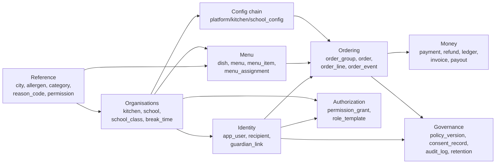
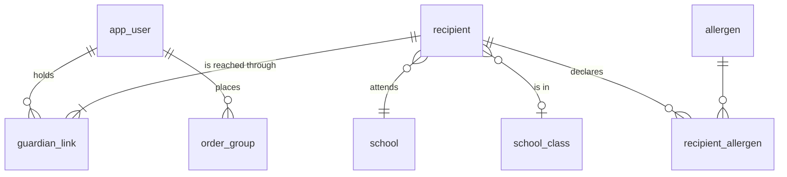
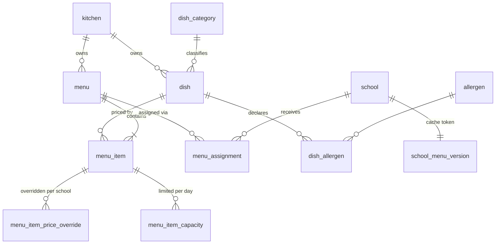
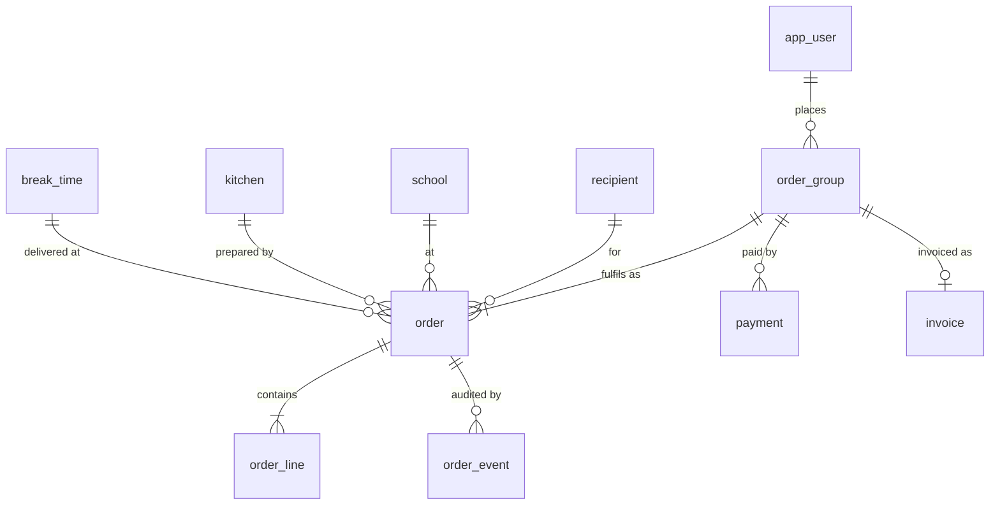
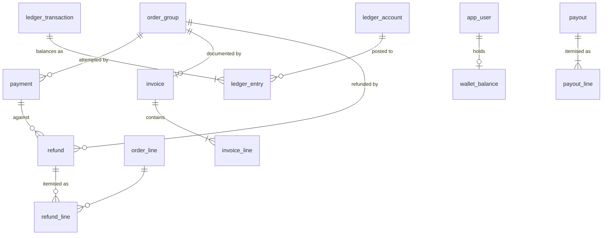

# GrayBag — target data model

This is the design source of truth for the schema. `supabase/migrations/0001_initial_schema.sql`
(Q02) is generated **from this document** and must not invent anything that is not here.
Authorization is specified separately in `docs/authorization-model.md` (Q03); this document
describes only the shape of the data and the columns the policies will key off.

Every genuinely open decision is marked inline as **`[DM-nn]`** and repeated in
[§14 Open decisions](#14-open-decisions) and in `docs/open-questions.md`. Nothing marked
`[DM-nn]` has been assumed settled — where a placeholder was needed to keep the model
coherent, the recommended option is used and labelled as such.

## Contents

1. [Conventions](#1-conventions)
2. [Domain map](#2-domain-map)
3. [Reference and geography](#3-reference-and-geography)
4. [Identity and people](#4-identity-and-people)
5. [Organisations](#5-organisations)
6. [Menu](#6-menu)
7. [Ordering](#7-ordering)
8. [Money](#8-money)
9. [Configuration resolution chain](#9-configuration-resolution-chain)
10. [Permissions and grants](#10-permissions-and-grants)
11. [Policy, consent and data-subject rights](#11-policy-consent-and-data-subject-rights)
12. [Operational tables](#12-operational-tables)
13. [Cross-cutting rules](#13-cross-cutting-rules)
14. [Open decisions](#14-open-decisions)
15. [Traceability](#15-traceability)

---

## 1. Conventions

### 1.1 Naming

| Rule | Value |
|---|---|
| Table names | `snake_case`, **singular** (`order`, `menu_item`, not `orders`) |
| Schema | everything in `public` unless noted; migration staging in `migration` |
| Primary key column | always `id` |
| Foreign key column | `<referenced_table>_id` |
| Boolean columns | `is_` / `has_` / `can_` prefix |
| Timestamps | `_at` suffix, always `timestamptz` |
| Snapshot columns | `_snapshot` suffix, so it is obvious the value is frozen |
| Enum types | `snake_case`, suffixed `_enum` is **not** used — the type is just `order_status` |

`order`, `user` and `grant` are all SQL reserved or near-reserved words. `order` is kept
(quoted where needed — PostgREST handles it fine and the domain term matters), `user` becomes
`app_user`, and `grant` becomes `permission_grant`. See `docs/learnings.md`.

### 1.2 Identifiers

| Kind of table | PK type | Why |
|---|---|---|
| Entities exposed in URLs, APIs or the mobile app | `uuid` default `gen_random_uuid()` | Non-enumerable; safe to expose; no cross-environment collisions during migration rehearsals |
| Pure append-only internal logs (`ledger_entry`, `audit_log`, `order_event`, `payment_webhook_event`, `order_line`, `invoice_line`, `consent_record`, `user_policy_acceptance`, `notification_delivery`) | `bigint generated always as identity` | Index locality matters on the tables that grow fastest, and none of them are addressed by id from a client |
| Lookup tables (`permission`, `reason_code`, `policy_document`, `consent_purpose`, `retention_policy`) | natural `text` code | The code *is* the meaning; joins read correctly in a query and in a log line |

### 1.3 Money — non-negotiable

- **All monetary amounts are `bigint`, in integer paise.** Never `numeric`, never `float`,
  never rupees. Column names end in `_paise` with no exceptions, so a wrong unit is visible
  in review.
- `bigint` not `integer`: `int4` tops out at ₹21.4 million, which a cumulative ledger account
  or a multi-year payout total will exceed. The extra 4 bytes are irrelevant.
- **All percentages are integer basis points** in a column ending `_bps`, range 0–10000.
  10% revenue share is `1000`. 2.5% CGST is `250`. Same reasoning as paise: no float ever
  touches money.
- Every money column carries `CHECK (col >= 0)` unless it is explicitly signed
  (`round_off_paise`, `payout_line.amount_paise`), and signed columns say so in their notes.
- Currency is `char(3)` defaulting to `'INR'` on the tables that face a payment provider.
  There is no multi-currency requirement; the column exists so that a Razorpay response can
  be stored verbatim and asserted against.

### 1.4 Time

- All instants are `timestamptz`. Postgres stores UTC; the application never stores a naive
  timestamp.
- `service_date` is a `date` — the day the food is eaten. It is a calendar concept, not an
  instant, and it is the axis every kitchen and reporting query uses.
- Wall-clock times that belong to a place (break start/end, order cutoff) are `time` and are
  resolved against an IANA timezone from the config chain (`Asia/Kolkata` at platform level).
- **No denormalised date parts.** The legacy `Order` carried `order_ymd`, `order_week`,
  `order_month`, `order_year` because Bubble could not query dates. Postgres can. These are
  deleted (E02-14) and replaced by expression indexes where a report needs them.

### 1.5 Standard columns

Unless a table's section says otherwise, every entity table has:

| Column | Type | Notes |
|---|---|---|
| `id` | see §1.2 | |
| `created_at` | `timestamptz not null default now()` | |
| `updated_at` | `timestamptz not null default now()` | maintained by a shared `set_updated_at()` trigger |

Tables holding personal data additionally carry `deleted_at` and `anonymised_at` (§13.4).
Tables migrated from Bubble carry `legacy_bubble_id text unique` (§12.5).

### 1.6 Enums vs lookup tables

| Use | For |
|---|---|
| Native Postgres `ENUM` | Closed technical sets the application branches on: `order_status`, `ledger_direction`, `scope_type`, `payment_status`, `delivery_mode` |
| Lookup table | Business sets that admin will extend without a deploy: `dish_category`, `allergen`, `reason_code`, `permission`, `consent_purpose`, `policy_document` |

Rule of thumb: if adding a value requires a code change anyway, use an enum; if it does not,
use a table. `ALTER TYPE … ADD VALUE` cannot be used in the same transaction that adds it,
which makes enum growth mildly awkward in a migration — a second reason to keep the enum set
small and genuinely closed.

### 1.7 Volume assumptions

These drive the indexing choices in §13.5, and should be revisited if any is wrong.

| | Today | 12-month planning figure |
|---|---|---|
| Kitchens | 1 | 3–5 |
| Schools | 3 | 20–40 |
| Cities | **1 (SAS Nagar / Mohali)** — `SC1` | 3–6 |
| Customers | ~400 | 5,000–20,000 |
| Dishes per menu | ≤50 | ≤150 |
| Orders per service day | low hundreds | 2,000–5,000 |
| Order rows per year | ~10⁵ | ~10⁶ |

A million-row `order` table is small. That fact drives `[DM-05]`.

---

## 2. Domain map

Seven bounded areas. Arrows are "depends on".



The two structural ideas that make the whole model work, both carried over from
`docs/decisions.md`:

1. **School lives on the recipient, not the user** (D2). A user is just a person with a phone
   number. Every ordering question — which menu, which cutoff, which break time, which
   school's revenue share — is answered from the *recipient*. This is what makes a teacher
   ordering for themselves, a university student, and a parent with children at two schools
   the same code path with no role logic.
2. **Two authorization planes** (D3). Customers reach data through `guardian_link`; back
   office reaches data through `permission_grant`. There is no role column anywhere. The
   legacy `User.Role` enum, which mixed identity with capability, is deleted.

---

## 3. Reference and geography

### 3.1 `city`

Replaces the legacy `Cities` option set. A table rather than an enum because D9 expects
multi-city expansion, because schools and kitchens need to reference it, and because the GST
state code for place of supply (E07-02) has to live somewhere.

| Column | Type | Null | Default | Notes |
|---|---|---|---|---|
| `id` | uuid | no | `gen_random_uuid()` | |
| `code` | text | no | | slug, e.g. `sas_nagar`. Unique |
| `name` | text | no | | "SAS Nagar (Mohali)" |
| `state_name` | text | no | | "Punjab" |
| `gst_state_code` | char(2) | no | | Statutory 2-digit code — Chandigarh `04`, Punjab `03`, Haryana `06`. Drives place of supply on the invoice |
| `country_code` | char(2) | no | `'IN'` | |
| `timezone` | text | no | `'Asia/Kolkata'` | IANA name. Present for correctness; India has one zone today |
| `is_active` | boolean | no | `true` | |

- **Unique**: `(code)`
- **Index**: none needed beyond the PK and unique — the table has single-digit rows

### 3.2 `dish_category`

Replaces the legacy `Categories` option set (Breakfast, Bakery, Sandwich, Salads,
Continental, Quick Bites, Meals, Drinks). The legacy value **"All" is not migrated** — it is a
UI affordance, not a category.

| Column | Type | Null | Default | Notes |
|---|---|---|---|---|
| `id` | uuid | no | | |
| `code` | text | no | | Unique, e.g. `quick_bites` |
| `display_name` | text | no | | |
| `sort_order` | smallint | no | `0` | Drives tab order in the app |
| `image_asset_id` | uuid → `asset` | yes | | Legacy categories each had a CDN image |
| `is_active` | boolean | no | `true` | |

### 3.3 `allergen`

D7 — structured tags from day one, because the source Excel already has an Allergens column.
This is what makes the add-to-cart warning (E05-05) nearly free.

| Column | Type | Null | Default | Notes |
|---|---|---|---|---|
| `id` | uuid | no | | |
| `code` | text | no | | Unique. `peanut`, `tree_nut`, `milk`, `egg`, `gluten`, `soy`, `sesame`, `fish`, `crustacean`, `mustard`, `celery`, `sulphite` |
| `display_name` | text | no | | |
| `description` | text | yes | | Shown in the warning sheet |
| `is_major` | boolean | no | `false` | Flags the statutory major-allergen set for prominent display |
| `sort_order` | smallint | no | `0` | |
| `is_active` | boolean | no | `true` | |

> **`[DM-13]` Open — allergen seed list.** The codes above are a first cut aligned to the
> allergens India's FSSAI labelling rules require to be declared, plus three common European
> ones. The authoritative input is the **distinct values actually present in the Allergens
> column** of `GrayBag_School_Menu 1 1.xlsx`, which `Q08` produces. Do not freeze the seed
> list until that output exists and Andy has confirmed the mapping, because an allergen that
> exists in the data but not in this table becomes an unwarned allergy.

### 3.4 `reason_code`

One lookup for every "why did this happen" code in the system, so cancellations, refunds and
ledger postings share a vocabulary and reports can group by it.

| Column | Type | Null | Default | Notes |
|---|---|---|---|---|
| `code` | text | **PK** | | e.g. `dish_unavailable`, `customer_cancelled`, `school_holiday`, `kitchen_closed`, `payment_failed`, `duplicate_payment`, `goodwill`, `migration_opening_balance` |
| `category` | `reason_category` | no | | `cancellation` \| `refund` \| `ledger` \| `adjustment` |
| `display_name` | text | no | | |
| `requires_note` | boolean | no | `false` | Forces free text in admin UI, e.g. `goodwill` |
| `is_customer_visible` | boolean | no | `false` | Controls whether it appears in the app |
| `is_active` | boolean | no | `true` | |

---

## 4. Identity and people



### 4.1 `app_user`

One flat table, one ordering role (D1). `Parent`, `CollegeStudent` and `SchoolStaff` are
deleted. Row id **is** the Supabase `auth.users` id, so RLS predicates are a direct
`auth.uid()` comparison with no join.

| Column | Type | Null | Default | Notes |
|---|---|---|---|---|
| `id` | uuid | **PK**, FK → `auth.users(id)` `on delete restrict` | | Not generated — supplied by Supabase Auth |
| `phone_e164` | text | no | | **E.164 with `+`** (E02-17). `CHECK (phone_e164 ~ '^\+[1-9][0-9]{7,14}$')`. Unique |
| `phone_verified_at` | timestamptz | yes | | Set on first successful OTP |
| `email` | citext | yes | | Optional (E03-07), used for invoices and receipts. Unique where not null |
| `email_verified_at` | timestamptz | yes | | |
| `first_name` | text | yes | | PII |
| `last_name` | text | yes | | PII |
| `is_disabled` | boolean | no | `false` | Replaces legacy `User.disabled` |
| `disabled_reason` | text | yes | | |
| `locale` | text | no | `'en-IN'` | English only in v1 (P10); the column costs nothing |
| `last_seen_at` | timestamptz | yes | | |
| `migration_source` | `migration_source` | no | `'native'` | `native` \| `bubble_migrated` |
| `claimed_at` | timestamptz | yes | | When a migrated account was first claimed by OTP (E03-11) |
| `deleted_at` | timestamptz | yes | | Soft delete (§13.4) |
| `anonymised_at` | timestamptz | yes | | PII scrubbed but row retained for invoice/ledger integrity |
| `legacy_bubble_id` | text | yes | | Unique where not null |

- **Unique**: `(phone_e164)`; `(email) where email is not null`; `(legacy_bubble_id) where not null`
- **Index**: `(deleted_at) where deleted_at is null` is not worth it at this size; instead
  every query filters on it and the planner uses the PK
- **Deliberately absent**: `Stripe_id` and `current_client_secret`. Stripe is gone entirely
  (A6), and a client secret must never be stored on a user row.

**What the legacy model got wrong here, and what replaces it**

| Legacy | Problem | Replacement |
|---|---|---|
| `mobile` typed as *number* | Leading zeros and `+91` already lost in the stored data | `phone_e164 text` with a format check and a uniqueness constraint (E02-17) |
| `school` on the user | Breaks for a parent with children at two schools, and for a parent who is also a teacher | School moved to `recipient` (D2) |
| `Role` option set | Mixed *who you are* with *what you can do* | Deleted. Customers are implicit; back office uses `permission_grant` (D3) |
| `child` as a list on the user | Bubble list field, no metadata, no revocation | `guardian_link` join table |

> **`[DM-11]` Open — how migrated-but-unclaimed users are represented.** ~400 Bubble users
> must exist with their order history from the moment of cutover, but they have no Supabase
> auth identity until they log in.
> **Option A (recommended):** pre-create the `auth.users` row at migration with the phone set
> and no password, and create the matching `app_user` row. "Claiming" is then just a normal
> OTP login; `claimed_at` records it. All history is live and reportable from cutover.
> **Option B:** hold unclaimed users in a `migration.*` staging schema and promote on first
> login. Nothing unclaimed is ever reachable by RLS, but financial totals and order history
> are incomplete until people log in, which makes reconciliation during the beta unreadable.
> Under either option, **any ambiguous or duplicate phone match must not be auto-created** —
> it goes to `migration_review` (§12.5) for a human. This is the failure mode that would let
> one OTP claim the wrong family's children.

### 4.2 `recipient`

The person who eats the food. Either the user themself (`is_self = true`) or a dependent.
This single table is what removes all the legacy role branching.

| Column | Type | Null | Default | Notes |
|---|---|---|---|---|
| `id` | uuid | no | | |
| `is_self` | boolean | no | `false` | True when the recipient is the ordering adult |
| `first_name` | text | no | | **PII, minor** |
| `last_name` | text | yes | | **PII, minor** |
| `school_id` | uuid → `school` | no | | Self-declared from onboarded schools only (P1). School code is dead |
| `school_class_id` | uuid → `school_class` | yes | | Preferred |
| `class_label` | text | yes | | Free-text fallback while `school_class` is unpopulated — see `[DM-08]` |
| `section_label` | text | yes | | ditto |
| `is_minor` | boolean | no | `true` | Drives the DPDP consent requirement — see `[DM-12]` |
| `allergy_note` | text | yes | | **Health data.** Free text for anything the tag list cannot express |
| `created_by_user_id` | uuid → `app_user` | yes | | **Audit only. Never an authorization path** |
| `is_active` | boolean | no | `true` | |
| `deleted_at` / `anonymised_at` | timestamptz | yes | | |
| `legacy_bubble_id` | text | yes | | |

- **Index**: `(school_id, is_active)`, `(school_class_id)`
- **Constraint**: a `recipient` must have at least one active `guardian_link`. Enforced by a
  `deferrable initially deferred` constraint trigger so that recipient + link can be inserted
  in one transaction.
- **Constraint**: `is_self = true` requires the sole active link to have
  `relationship = 'self'`.

The `created_by_user_id` note matters. The single worst structural defect in the legacy model
was **two parallel parent→child links** (`Child.Parent` list *and* `Guardian_Link`), which
means there are two answers to "may this user see this child" and they can disagree. Here
there is exactly one: an active `guardian_link` row. `created_by_user_id` exists so an admin
can answer "who added this record", and RLS must never reference it (E02-14, E16-03).

> **`[DM-08]` Open — class and section as controlled vocabulary or free text.** The legacy
> fields are free text and "5A", "5 A" and "V-A" will all appear. That silently breaks
> "mark all delivered for this class" (E09-05) and the packing list grouped
> school → break → class → section (E09-03), which are the two things the kitchen actually
> uses at 7am.
> **Recommended:** an admin-maintained `school_class` list per school (§5.3), with
> `class_label`/`section_label` kept as a nullable fallback and a report of recipients not
> yet mapped. A class list is perhaps 30 rows per school and is *not* a roster, so it does
> not reopen P1 — schools refused to maintain who is in each class, not what the classes are.
> **Alternative:** free text plus a normalisation function. Cheaper, and wrong the first time
> a school writes "Grade 5".
> Needs Andy: will schools give us a class/section list at onboarding?

> **`[DM-12]` Open — how a minor is identified for DPDP.** DPDP obligations (verifiable
> parental consent) attach to data subjects under 18. Options: store `date_of_birth`
> (maximum accuracy, maximum data collection about a child — the opposite of minimisation);
> infer from `school.institution_type` and class (no extra data, wrong for a college student
> who is 17 or a school recipient who is 18); or a declared `is_minor` boolean set at
> creation, defaulting true for dependents and false for `is_self`.
> **Recommended:** declared `is_minor`, no date of birth. Blocked on `E20-01` legal review —
> if the lawyer says age must be verified rather than declared, this changes.

### 4.3 `guardian_link`

The **only** path from a user to a recipient. Replaces both legacy mechanisms.

| Column | Type | Null | Default | Notes |
|---|---|---|---|---|
| `id` | uuid | no | | |
| `recipient_id` | uuid → `recipient` | no | | |
| `user_id` | uuid → `app_user` | no | | |
| `relationship` | `guardian_relationship` | no | | `self` \| `mother` \| `father` \| `guardian` \| `carer` \| `staff`. A real enum, not the legacy free text |
| `can_order` | boolean | no | `true` | |
| `can_manage` | boolean | no | `true` | Edit the recipient's details and allergies |
| `is_primary` | boolean | no | `false` | The contact for notifications and the invoice |
| `created_by_user_id` | uuid → `app_user` | yes | | |
| `revoked_at` | timestamptz | yes | | Links are revoked, never deleted — the audit trail matters |
| `revoked_by_user_id` | uuid → `app_user` | yes | | |

- **Unique**: `(recipient_id, user_id) where revoked_at is null`
- **Unique**: `(recipient_id) where is_primary and revoked_at is null` — exactly one primary
- **Index**: `(user_id) where revoked_at is null` — this is the hot RLS lookup

The legacy `Guardian_Relationship` option set had `Father→parent`, `Mother→mother`,
`Parent→parent0` — two display values collapsing to overlapping db values. Migration maps on
db value with a hand-written table, and both `parent` and `parent0` land on `guardian` unless
the label disambiguates (E16-03 reports conflicts rather than guessing).

### 4.4 `recipient_allergen`

**Health data about a minor.** The most sensitive table in the system. Everything in §13.3
applies to it with no exceptions.

| Column | Type | Null | Default | Notes |
|---|---|---|---|---|
| `recipient_id` | uuid → `recipient` | **PK** | | |
| `allergen_id` | uuid → `allergen` | **PK** | | |
| `severity` | `allergy_severity` | yes | | `intolerance` \| `allergy` \| `anaphylaxis`. Nullable — v1 only warns, but the kitchen will eventually want the distinction |
| `note` | text | yes | | **Health data** |
| `recorded_by_user_id` | uuid → `app_user` | yes | | |
| `recorded_at` | timestamptz | no | `now()` | |

---

## 5. Organisations

### 5.1 `kitchen`

| Column | Type | Null | Default | Notes |
|---|---|---|---|---|
| `id` | uuid | no | | |
| `code` | text | no | | Unique slug, used in report filenames and log lines |
| `name` | text | no | | |
| `city_id` | uuid → `city` | no | | |
| `address_line1` / `address_line2` | text | yes | | |
| `postcode` | text | yes | | |
| `contact_name` | text | yes | | |
| `contact_email` | citext | yes | | |
| `contact_phone` | text | yes | | E.164 |
| `is_active` | boolean | no | `true` | |
| `legacy_bubble_id` | text | yes | | |

- **Index**: `(city_id, is_active)`

Legacy `Kitchen.owner-email` — a **string** standing in for a person — is deleted. Kitchen
staff become real `app_user` rows with a `permission_grant` scoped to the kitchen (E16-17).
Legacy `default_menu` is also deleted; menu reach is decided entirely by `menu_assignment`
(D4).

### 5.2 `school`

| Column | Type | Null | Default | Notes |
|---|---|---|---|---|
| `id` | uuid | no | | |
| `code` | text | no | | Unique slug |
| `name` | text | no | | |
| `city_id` | uuid → `city` | no | | |
| `kitchen_id` | uuid → `kitchen` | no | | The kitchen that serves this school — see `[DM-16]` |
| `institution_type` | `institution_type` | no | `'school'` | `school` \| `college`. Replaces the legacy `isCollege` boolean |
| `address_line1` / `address_line2` | text | yes | | |
| `postcode` | text | yes | | |
| `contact_name` | text | yes | | |
| `contact_email` | citext | yes | | Where the monthly PDF report goes (E11-05) |
| `contact_phone` | text | yes | | |
| `is_active` | boolean | no | `true` | |
| `onboarded_at` | timestamptz | yes | | Only onboarded schools appear in the app's school picker |
| `offboarded_at` | timestamptz | yes | | |
| `legacy_bubble_id` | text | yes | | |

- **Index**: `(city_id, is_active)`, `(kitchen_id)`
- Legacy `School.menu` is deleted — third competing path to a menu, resolved by D4.

> **`[DM-16]` Open — can one school be served by more than one kitchen?** Modelled today as
> `school.kitchen_id NOT NULL`, one kitchen per school.
> **Recommended:** keep the FK. It is correct today and a straight `school_kitchen` join with
> validity dates if a school is ever split across kitchens — a contained migration because
> nothing else keys off it.
> **Alternative:** build the join table now. Costs a join on every order write for a case
> that does not exist. Needs Andy only to confirm it is not already planned.

### 5.3 `school_class`

Admin-maintained list of the classes and sections that exist at a school. Not a roster.
See `[DM-08]`.

| Column | Type | Null | Default | Notes |
|---|---|---|---|---|
| `id` | uuid | no | | |
| `school_id` | uuid → `school` | no | | |
| `class_label` | text | no | | "5", "Grade 5", "V" — whatever the school calls it |
| `section_label` | text | yes | | "A". Null means the class has no sections |
| `sort_order` | smallint | no | `0` | So the packing list prints in school order, not alphabetical |
| `is_active` | boolean | no | `true` | |

- **Unique**: `(school_id, class_label, coalesce(section_label,''))`

### 5.4 `break_time`

Legacy `Break-Timings` stored `break_start` and `break_end` as **text**, and the option set's
db values contradict their labels (`10__00_am` renders as "10:40AM - 11:15AM"). Both defects
are fixed here: real `time` columns, and the legacy value carried through only so the
hand-verified migration lookup (E16-15) has somewhere to land.

| Column | Type | Null | Default | Notes |
|---|---|---|---|---|
| `id` | uuid | no | | |
| `school_id` | uuid → `school` | no | | |
| `code` | text | no | | Unique per school, e.g. `break_1` |
| `label` | text | no | | "Morning break" — what the customer sees |
| `starts_at` | time | no | | Real time type (E02-14) |
| `ends_at` | time | no | | `CHECK (ends_at > starts_at)` |
| `sort_order` | smallint | no | `0` | |
| `is_active` | boolean | no | `true` | |
| `legacy_option_value` | text | yes | | e.g. `10__00_am`. **Never trust it** — see `break_time_legacy_map` (§12.5) |

- **Unique**: `(school_id, code)`
- **Index**: `(school_id, is_active, sort_order)`

### 5.5 `break_time_class` — designed, unused in v1

E05-06 says break selection must "support different times for different class groups later".
That is a join table, and it is cheaper to create it empty now than to add it after orders
exist.

| Column | Type | Notes |
|---|---|---|
| `break_time_id` | uuid → `break_time` | **PK** |
| `school_class_id` | uuid → `school_class` | **PK** |

**Semantics: an empty set means the break applies to every class.** v1 never writes to this
table; the resolver reads "no rows for this break ⇒ applies to all", so switching it on later
is data, not code.

---

## 6. Menu



### 6.1 `dish`

| Column | Type | Null | Default | Notes |
|---|---|---|---|---|
| `id` | uuid | no | | |
| `kitchen_id` | uuid → `kitchen` | no | | See `[DM-06]` |
| `name` | text | no | | |
| `description` | text | yes | | |
| `ingredients_text` | text | yes | | Free text from the Excel `Ingredients` column |
| `calories_kcal` | integer | yes | | Legacy stored this as **text**; parsed to an integer on import, and left null when unparseable rather than guessed |
| `portion_text` | text | yes | | From `Portion/Weight` |
| `nutrition` | jsonb | yes | | Unstructured extras; no query keys off it |
| `category_id` | uuid → `dish_category` | no | | |
| `food_type` | `food_type` | yes | | `veg` \| `non_veg` \| `egg`. See `[DM-17]` |
| `image_asset_id` | uuid → `asset` | yes | | |
| `is_active` | boolean | no | `true` | |
| `legacy_bubble_id` | text | yes | | |

- **Unique**: `(kitchen_id, lower(name))` — a soft guard so a re-run of the Excel importer
  updates rather than duplicating
- **Index**: `(kitchen_id, is_active)`, `(category_id)`
- Price is **not** on `dish`. The legacy model already moved it to `Menu_Item`, which was
  correct, and it stays there.

> **`[DM-06]` Open — is a dish owned by a kitchen or by the platform?** Modelled as
> kitchen-owned (`kitchen_id NOT NULL`).
> **Recommended:** kitchen-owned. A dish is a thing a specific kitchen makes; calories,
> portion and ingredients are properties of *their* version of it. Two kitchens making a
> "Veg Sandwich" get two rows, which is honest.
> **Alternative:** a platform catalogue with per-kitchen overrides. Better if GrayBag ever
> franchises a standard menu across cities; more machinery than one kitchen justifies.
> Needs Andy: is the intent that a new city's kitchen inherits a standard GrayBag menu?

> **`[DM-17]` Open — veg / non-veg / egg marking.** `food_type` is not a column in the source
> Excel, so the importer cannot fill it. In the Indian market this is close to a required
> field, and getting it wrong is a serious trust failure.
> **Recommended:** keep the column, nullable, and have admin fill it for the ~50 existing
> dishes before launch; make it required for any dish created after launch.
> Needs Andy: confirm it is expected at launch, and who fills it in.

### 6.2 `dish_allergen`

| Column | Type | Notes |
|---|---|---|
| `dish_id` | uuid → `dish` | **PK** |
| `allergen_id` | uuid → `allergen` | **PK** |
| `presence` | `allergen_presence` | `contains` \| `may_contain`. The Excel only supports `contains`; `may_contain` exists because a kitchen will eventually need it |

- **Index**: `(allergen_id)` for "which dishes contain peanuts"

### 6.3 `menu`

| Column | Type | Null | Default | Notes |
|---|---|---|---|---|
| `id` | uuid | no | | |
| `kitchen_id` | uuid → `kitchen` | no | | |
| `name` | text | no | | |
| `status` | `menu_status` | no | `'draft'` | `draft` \| `active` \| `retired` |
| `version` | integer | no | `1` | Incremented on **any** change to the menu or its items (E04-08) |
| `notes` | text | yes | | |
| `published_at` / `retired_at` | timestamptz | yes | | |
| `created_by_user_id` | uuid → `app_user` | yes | | |
| `legacy_bubble_id` | text | yes | | |

- **Index**: `(kitchen_id, status)`
- **Deliberately absent**: legacy `active_from` / `active_to` / `is_default_for_kitchen`.
  Validity and reach belong to `menu_assignment` (D4). Keeping them would restore exactly the
  three-competing-paths ambiguity D4 exists to remove.

### 6.4 `menu_item`

| Column | Type | Null | Default | Notes |
|---|---|---|---|---|
| `id` | uuid | no | | |
| `menu_id` | uuid → `menu` | no | | |
| `dish_id` | uuid → `dish` | no | | |
| `price_paise` | bigint | no | | `CHECK (price_paise >= 0)`. See `[DM-14]` for what this figure means w.r.t. GST |
| `category_id` | uuid → `dish_category` | yes | | Override; falls back to `dish.category_id` |
| `available_days` | smallint[] | no | `'{1,2,3,4,5,6}'` | ISO weekday numbers, 1 = Monday. `CHECK` every element between 1 and 7 |
| `is_active` | boolean | no | `true` | |
| `sort_order` | smallint | no | `0` | |

- **Unique**: `(menu_id, dish_id)`
- **Index**: `(menu_id, is_active)`
- The legacy option set for this was named `unavailable_days` but used as *available* days.
  The column here is named for what it means.

### 6.5 `menu_assignment`

D4. The single answer to "which menu does this school see today".

| Column | Type | Null | Default | Notes |
|---|---|---|---|---|
| `id` | uuid | no | | |
| `school_id` | uuid → `school` | no | | |
| `menu_id` | uuid → `menu` | no | | |
| `valid_from` | date | no | | Inclusive |
| `valid_to` | date | yes | | **Exclusive**. Null = open-ended |
| `created_by_user_id` | uuid → `app_user` | yes | | |
| `revoked_at` | timestamptz | yes | | |

- **Exclusion constraint** (requires `btree_gist`):
  `EXCLUDE USING gist (school_id WITH =, daterange(valid_from, coalesce(valid_to, 'infinity'::date), '[)') WITH &&) WHERE (revoked_at IS NULL)`
  — the database, not the application, guarantees a school never has two live menus on the
  same day. This is the constraint that makes the legacy ambiguity structurally impossible.
- **Index**: `(menu_id)`

### 6.6 `menu_item_price_override`

E04-05 allows a per-school price override in the importer, and D5 puts prices in the config
chain. This is the concrete table the chain reads for prices.

| Column | Type | Null | Notes |
|---|---|---|---|
| `id` | uuid | no | |
| `school_id` | uuid → `school` | no | |
| `menu_item_id` | uuid → `menu_item` | no | |
| `price_paise` | bigint | no | `CHECK >= 0` |
| `valid_from` | date | no | |
| `valid_to` | date | yes | Exclusive, null = open-ended |
| `created_by_user_id` | uuid → `app_user` | yes | |

- **Exclusion constraint**: same shape as §6.5, keyed on `(school_id, menu_item_id)`
- Resolution order for the price of a dish at a school on a date:
  `menu_item_price_override` → `menu_item.price_paise`. Whichever wins is **snapshotted onto
  the order line** at write time, so a later price change never rewrites history.

### 6.7 `menu_item_capacity` — designed, unused in v1 (E02-12)

P3: per-dish limits are not in v1, but the table is designed now so it drops in without a
rewrite.

| Column | Type | Notes |
|---|---|---|
| `menu_item_id` | uuid → `menu_item` | **PK** |
| `service_date` | date | **PK** |
| `capacity_total` | integer | `CHECK >= 0` |
| `remaining` | integer | `CHECK (remaining >= 0 AND remaining <= capacity_total)` |
| `updated_at` | timestamptz | |

The decrement is a single atomic statement, never a `COUNT(*)`:

```sql
UPDATE menu_item_capacity
   SET remaining = remaining - $qty, updated_at = now()
 WHERE menu_item_id = $1 AND service_date = $2 AND remaining >= $qty
RETURNING remaining;
```

Zero rows returned means sold out. A row absent means unlimited, so switching capacity on is
an insert.

### 6.8 `school_menu_version`

E04-09 needs `GET /menu/version?school=X` to return a few bytes with no menu computation, and
E04-10 caches on the result. One row per school, bumped by trigger.

| Column | Type | Notes |
|---|---|---|
| `school_id` | uuid → `school` | **PK** |
| `menu_id` | uuid → `menu` | Currently effective menu, or null if none assigned |
| `version` | bigint | Monotonic. **Not** `menu.version` — it must also change when the *assignment* or a *price override* changes |
| `updated_at` | timestamptz | |

Triggers that bump it: `menu`, `menu_item`, `menu_assignment`, `menu_item_price_override`,
`dish` (only for dishes referenced by an assigned menu), and `asset` when a referenced dish
image is replaced.

Why a separate token rather than exposing `menu.version`: two schools sharing one menu but
with different price overrides must be able to invalidate independently, and a school whose
assignment simply flipped to a different menu has to invalidate even though neither menu
changed. This endpoint is called by every user on every app open, so it is also the first
thing to CDN-cache (E15-10) — a short TTL is safe because the value is monotonic.

---

## 7. Ordering

### 7.1 The shape decision

> **`[DM-01]` Open — and this is the one to read first.** How does a cart containing food for
> two children on two days become rows?
>
> **Option A — two levels.** `order` is the checkout unit; `order_line` carries
> `recipient_id`, `service_date` and `break_time_id`. Matches the legacy model, which already
> put `child` and `school` on `Dish_In_Order`. One order, one payment, one invoice.
> *Cost:* `order.status` becomes meaningless — one child's food is delivered while another's
> is not — so the E06-05 state machine has to move to the line, and every kitchen and
> cutoff query has to reason about a mixed bag. Cutoff differs per line because service dates
> differ within one order.
>
> **Option B — three levels (recommended, and what this document models).**
> `order_group` is the checkout and payment unit. `order` is one *(recipient, service_date,
> break)* — the fulfilment unit. `order_line` is dishes. One payment and one invoice attach
> to the group; status, cutoff, delivery and refunds attach to the order.
> *Benefit:* `order.status` stays a clean state machine, the kitchen packing list
> (school → break → class → section) is a single indexed query on `order`, cutoff is one
> snapshot per order, and "reject one dish, deliver the rest" (E06-08, E09-08) is still a
> line-level refund. Ordering a week ahead (E05-08) and future subscriptions (E18-07) both
> become "one group, seven orders" with no new concepts.
> *Cost:* one extra table, and invoice/payment cardinality moves up a level (`[DM-02]`).
>
> Needs Andy: confirm a parent **can** pay once for two children / two days. If checkout is
> always one child for one day, Option A collapses to the same thing and the extra table is
> waste. Everything below assumes B.



### 7.2 `order_group`

| Column | Type | Null | Default | Notes |
|---|---|---|---|---|
| `id` | uuid | no | | |
| `customer_user_id` | uuid → `app_user` | no | | The paying adult. **One** user pointer, not the legacy three |
| `correlation_id` | uuid | no | `gen_random_uuid()` | E02-13. Threaded through every log line, event, payment and ledger posting |
| `idempotency_key` | text | no | | Supplied by the client (E05-12) |
| `status` | `order_group_status` | no | `'draft'` | `draft` \| `pending_payment` \| `paid` \| `payment_failed` \| `cancelled` \| `refunded` \| `partially_refunded` |
| `city_id` | uuid → `city` | no | | Denormalised for reporting (D9) |
| `currency` | char(3) | no | `'INR'` | |
| `subtotal_paise` | bigint | no | `0` | Σ of member orders |
| `tax_total_paise` | bigint | no | `0` | Σ of member orders |
| `discount_paise` | bigint | no | `0` | |
| `wallet_applied_paise` | bigint | no | `0` | Wallet balance consumed at checkout (E06-10) |
| `payable_paise` | bigint | no | `0` | What Razorpay is asked for = subtotal + tax − discount − wallet |
| `placed_at` | timestamptz | yes | | |
| `paid_at` | timestamptz | yes | | |

- **Unique**: `(customer_user_id, idempotency_key)` — this single constraint is the whole of
  E05-12. Two devices submitting the same cart collide on insert; the second gets the first's
  result back.
- **Index**: `(customer_user_id, placed_at desc)` — order history
- **Constraint**: `payable_paise = subtotal_paise + tax_total_paise - discount_paise - wallet_applied_paise`,
  and the totals must equal the sum over member orders. Enforced by a deferred constraint
  trigger, because the rows are written in one transaction.

### 7.3 `order`

One recipient, one service date, one break. The unit the kitchen makes and delivers.

| Column | Type | Null | Default | Notes |
|---|---|---|---|---|
| `id` | uuid | no | | |
| `order_group_id` | uuid → `order_group` | no | | |
| `order_ref` | text | no | | Short human code for support, e.g. `GB-8F3K2Q`. Unique |
| `correlation_id` | uuid | no | | Copied from the group |
| `customer_user_id` | uuid → `app_user` | no | | Denormalised from the group **deliberately**, so the customer RLS predicate on the hottest table is a column compare with no join |
| `recipient_id` | uuid → `recipient` | no | | |
| `school_id` | uuid → `school` | no | | Snapshot of the recipient's school at order time |
| `kitchen_id` | uuid → `kitchen` | no | | |
| `city_id` | uuid → `city` | no | | D9 — a Chandigarh report must never scan Delhi rows |
| `service_date` | date | no | | |
| `break_time_id` | uuid → `break_time` | yes | | Null for counter pickup |
| `delivery_mode` | `delivery_mode` | no | | `classroom` \| `counter` (P4, P5) |
| `pickup_code` | char(4) | yes | | Counter collection (P4). See `[DM-10]` |
| `status` | `order_status` | no | `'draft'` | See §7.6 |
| `subtotal_paise` | bigint | no | `0` | |
| `tax_cgst_paise` | bigint | no | `0` | M2 — split, never a single "5% tax" |
| `tax_sgst_paise` | bigint | no | `0` | |
| `tax_igst_paise` | bigint | no | `0` | Always 0 while place of supply is intra-state; present so an inter-state order is representable |
| `discount_paise` | bigint | no | `0` | |
| `total_paise` | bigint | no | `0` | |
| `refunded_total_paise` | bigint | no | `0` | Running total, maintained with each refund |
| `cutoff_at` | timestamptz | no | | **Snapshot** of the resolved cutoff (D5). Enforcement compares against this, not a re-resolution |
| `config_snapshot` | jsonb | no | | The whole resolved config row at write time — revenue share bps, tax rates, cutoff, delivery rules |
| `school_name_snapshot` | text | no | | |
| `break_label_snapshot` | text | yes | | Legacy break labels drifted from their values; a snapshot means an admin fixing the break record never rewrites a delivered order |
| `recipient_name_snapshot` | text | no | | **PII, minor.** Needed so the packing list is right even if the parent renames or removes the recipient. Purged by the retention policy (§13.4) |
| `class_label_snapshot` | text | yes | | |
| `section_label_snapshot` | text | yes | | |
| `placed_at` | timestamptz | yes | | |
| `confirmed_at` | timestamptz | yes | | Payment captured |
| `preparing_at` | timestamptz | yes | | |
| `delivered_at` | timestamptz | yes | | |
| `delivered_by_user_id` | uuid → `app_user` | yes | | |
| `cancelled_at` | timestamptz | yes | | |
| `cancelled_by_user_id` | uuid → `app_user` | yes | | |
| `cancel_reason_code` | text → `reason_code` | yes | | |
| `legacy_bubble_id` | text | yes | | |

**Indexes** — chosen against the actual query set, not speculatively:

| Index | Serves |
|---|---|
| `(kitchen_id, service_date, status)` | E09-01 aggregate production list — the 7am query |
| `(school_id, service_date, break_time_id)` | E09-03 packing list, E09-02 per-school view |
| `(customer_user_id, placed_at desc)` | Order history (E05-10) |
| `(recipient_id, service_date)` | "What has this child got coming" |
| `(city_id, service_date)` | D9 city-scoped reporting |
| `(order_group_id)` | FK traversal |
| `(correlation_id)` | Support: paste a correlation id, get everything |
| unique `(school_id, service_date, pickup_code) where pickup_code is not null` | E09-06 code lookup, and collision prevention |
| unique `(order_ref)` | Support lookup |
| `(status) where status in ('pending_payment','paid','preparing')` | Partial index over open orders — small and hot, while the table is mostly closed history |

**Deliberately absent**: `order_ymd`, `order_week`, `order_month`, `order_year` (E02-14 — the
legacy pre-computed date parts existed only because Bubble could not query dates); `payment_id`
*and* `payment-id` as two live text fields (money now lives in §8); `actor_user`,
`order-parent` and `staff_user` as three parallel user pointers (there is one paying customer
and one recipient, and who *did* something is in `order_event`).

> **`[DM-10]` Open — pickup code scope and guessability.** A 4-digit code is 10,000 values.
> Unique per `(school, service_date)` is comfortable at current volume and stays unique to
> ~100 orders per school-day before collisions get annoying; retries handle it.
> The real question is whether a guessed code can be used to collect someone else's food.
> **Recommended:** unique per `(school, service_date)`; codes are only valid on their service
> date; the staff lookup endpoint is rate-limited and requires `orders.mark_delivered`; the
> handover screen shows the recipient name so staff match code *and* name. Do not extend the
> code length — P4 chose 4 digits because it is read aloud by children.
> Needs Andy: confirm staff will check the name shown on screen, not just the code.

### 7.4 `order_line`

| Column | Type | Null | Default | Notes |
|---|---|---|---|---|
| `id` | bigint identity | no | | |
| `order_id` | uuid → `order` | no | | |
| `line_no` | smallint | no | | Stable line numbering for the invoice |
| `menu_item_id` | uuid → `menu_item` | yes | | `ON DELETE SET NULL` — history survives menu deletion |
| `dish_id` | uuid → `dish` | yes | | ditto |
| `quantity` | integer | no | | `CHECK (quantity > 0)` |
| `unit_price_paise` | bigint | no | | The resolved price — override or menu price |
| `line_subtotal_paise` | bigint | no | | `= unit_price_paise * quantity` |
| `tax_cgst_paise` | bigint | no | `0` | |
| `tax_sgst_paise` | bigint | no | `0` | |
| `line_total_paise` | bigint | no | | |
| `special_comments` | text | yes | | Legacy `special-comments`, kept |
| `status` | `order_line_status` | no | `'ordered'` | `ordered` \| `cancelled` \| `refunded` \| `partially_refunded` |
| `refunded_quantity` | integer | no | `0` | |
| `refunded_amount_paise` | bigint | no | `0` | |
| **snapshots** | | | | E02-04 — all `NOT NULL` |
| `dish_name_snapshot` | text | no | | |
| `dish_description_snapshot` | text | yes | | |
| `category_code_snapshot` | text | yes | | |
| `portion_snapshot` | text | yes | | |
| `food_type_snapshot` | `food_type` | yes | | |
| `allergen_codes_snapshot` | text[] | no | `'{}'` | The allergens as declared **at order time** |

- **Unique**: `(order_id, line_no)`
- **Index**: `(order_id)`, `(dish_id)`

The snapshot set is the fix for the sharpest legacy defect after authorization: legacy
`Dish_In_Order` snapshotted `unit_price` but **not** the dish name, so editing a dish rewrote
the history of every order that ever contained it. An invoice that changes retroactively is
not a valid tax document. `allergen_codes_snapshot` is here for the same reason plus a
stronger one — if a child had a reaction, the record must say what the dish was declared to
contain **on the day**, not what it says today.

*Deliberate non-optimisation:* the E09-01 aggregate production list joins `order_line` to
`order` to filter by `kitchen_id` and `service_date`. At the volumes in §1.7 that join is
free. If it ever is not, copy `kitchen_id` and `service_date` onto `order_line` by trigger —
a justified, documented denormalisation, unlike the legacy date parts. Not built.

### 7.5 `order_event`

Append-only history of every status change. This is what makes "why is this order in this
state" answerable in support, and it replaces the legacy model's total silence on the point.

| Column | Type | Null | Notes |
|---|---|---|---|
| `id` | bigint identity | no | |
| `order_id` | uuid → `order` | no | |
| `from_status` | `order_status` | yes | Null on creation |
| `to_status` | `order_status` | no | |
| `actor_type` | `actor_type` | no | `customer` \| `kitchen` \| `admin` \| `system` \| `payment_provider` |
| `actor_user_id` | uuid → `app_user` | yes | Null for system and provider |
| `reason_code` | text → `reason_code` | yes | |
| `note` | text | yes | Must not contain a recipient's name |
| `correlation_id` | uuid | no | |
| `metadata` | jsonb | yes | Provider event ids etc. No PII |
| `created_at` | timestamptz | no | |

- **Index**: `(order_id, created_at)`, `(correlation_id)`
- `UPDATE` and `DELETE` are revoked from all application roles.

### 7.6 Order status

`order_status`: `draft` → `pending_payment` → `paid` → `preparing` → `delivered`, plus
`cancelled` and `refunded` (E06-05).

Legal transitions are enforced by a trigger, and the full state machine — including payment
failure, app-kill-mid-payment, duplicate payment and cutoff edge cases — is specified in
`docs/order-lifecycle.md` (Q06). This document only guarantees the columns exist to record it.

Legacy status values map on **db value**: `new`→`draft`, `received`→`paid`,
`accepted`→`preparing`, `delivered`→`delivered`, `cancelled`→`cancelled`,
`refunded`→`refunded` (E16-04).

### 7.7 Cart

> **`[DM-09]` Open — is the cart server-side?** Modelled as **not present** in the schema.
> **Recommended:** client-only in v1. The cart is worthless if lost, optimistic UI and
> read-only offline (P8, E04-11) both want it local, and a server cart adds a sync problem
> with no user-visible benefit. Cross-device duplicate submission is already handled by
> `order_group`'s idempotency key.
> **Alternative:** `cart` / `cart_line` tables, so a cart survives a reinstall and admin can
> see abandoned carts. That is an analytics want, and E15-11 can measure checkout drop-off
> from events instead.
> Needs Andy only if "resume my cart on a new phone" is considered a launch requirement.

---

## 8. Money

Everything in this section obeys §1.3 without exception. E02-05 is the highest-risk task in
the schema, because a modelling error here is discovered by a customer, not a test.



### 8.1 `payment`

One row **per attempt**, not per order. A customer who fails on UPI and retries on card
produces two rows, and both are needed for E06-06 and for reconciliation.

| Column | Type | Null | Default | Notes |
|---|---|---|---|---|
| `id` | uuid | no | | |
| `order_group_id` | uuid → `order_group` | no | | |
| `provider` | `payment_provider` | no | `'razorpay'` | Only value in v1 (A6) |
| `provider_order_id` | text | no | | Razorpay order id. Unique |
| `provider_payment_id` | text | yes | | Razorpay payment id. Unique where not null |
| `method` | `payment_method` | yes | | `upi` \| `card` \| `netbanking` \| `wallet` \| `emi` \| `unknown` |
| `amount_paise` | bigint | no | | What was asked for |
| `currency` | char(3) | no | `'INR'` | |
| `status` | `payment_status` | no | `'created'` | `created` \| `authorized` \| `captured` \| `failed` \| `refunded` \| `partially_refunded` |
| `attempt_no` | smallint | no | `1` | |
| `failure_code` | text | yes | | Razorpay's code, stored verbatim |
| `failure_description` | text | yes | | |
| `provider_fee_paise` | bigint | yes | | MDR as reported by Razorpay — the input to M5 / E07-11 |
| `provider_tax_paise` | bigint | yes | | GST on the MDR |
| `authorized_at` / `captured_at` / `failed_at` | timestamptz | yes | | |
| `correlation_id` | uuid | no | | |
| `notes` | jsonb | yes | | Provider metadata. **Redacted** — see below |

- **Unique**: `(provider, provider_order_id)`, `(provider, provider_payment_id) where not null`
- **Unique partial**: `(order_group_id) where status = 'captured'` — the database refuses a
  second capture on one group. A genuine duplicate payment therefore fails to insert and is
  routed to refund rather than silently double-charging (E06-06).
- **Index**: `(order_group_id, created_at)`, `(status, created_at)` for the reconciliation job

**There is no `signature` column, by design.** The legacy `Temp` table stored Razorpay
signatures in an unbounded, world-readable table. Signatures are verified server-side on
receipt (E06-03) and then discarded. Nothing downstream needs them, and storing them creates
a credential-shaped asset with no owner. `notes` must never contain card data, VPA, or a
signature; the redaction list is enforced in the webhook handler and asserted by a test.

### 8.2 `payment_webhook_event`

E06-04. Razorpay retries; the same event must never be processed twice.

| Column | Type | Null | Notes |
|---|---|---|---|
| `id` | bigint identity | no | |
| `provider` | `payment_provider` | no | |
| `provider_event_id` | text | no | Razorpay's `x-razorpay-event-id` |
| `event_type` | text | no | `payment.captured`, `refund.processed`, … |
| `signature_verified` | boolean | no | **`NOT NULL`, no default.** The handler must state a verdict; there is no "we didn't check" |
| `payload` | jsonb | no | Redacted copy of the body |
| `received_at` | timestamptz | no | |
| `processing_status` | `webhook_processing_status` | no | `pending` \| `processed` \| `ignored` \| `failed` |
| `processed_at` | timestamptz | yes | |
| `attempt_count` | integer | no | |
| `error_text` | text | yes | |
| `related_payment_id` | uuid → `payment` | yes | |
| `correlation_id` | uuid | yes | |

- **Unique**: `(provider, provider_event_id)` — **this constraint is the idempotency
  guarantee.** The handler inserts first; a unique violation means "already seen, stop".
  Idempotency is a database constraint, not application logic that can be refactored away.
- **Index**: `(processing_status, received_at) where processing_status in ('pending','failed')`
- An event with `signature_verified = false` is recorded and **never acted on**, and raises
  the E15-05 alert. Recording it matters — a burst of signature failures is an attack signal.

### 8.3 `refund` and `refund_line`

E06-08 (full and per-line), E06-09 (wallet by default), E07-11 / M5 (MDR against the school's
share).

**`refund`**

| Column | Type | Null | Default | Notes |
|---|---|---|---|---|
| `id` | uuid | no | | |
| `order_group_id` | uuid → `order_group` | no | | |
| `order_id` | uuid → `order` | yes | | Null when the refund spans the group |
| `payment_id` | uuid → `payment` | yes | | Null for a wallet-only refund with no provider leg |
| `destination` | `refund_destination` | no | | `wallet` \| `source`. Default resolved from config (M7) |
| `amount_paise` | bigint | no | | `CHECK > 0` |
| `reason_code` | text → `reason_code` | no | | |
| `initiated_by_user_id` | uuid → `app_user` | yes | | Null when system-initiated |
| `status` | `refund_status` | no | `'pending'` | `pending` \| `processing` \| `completed` \| `failed` |
| `provider_refund_id` | text | yes | | Unique where not null |
| `mdr_paise` | bigint | no | `0` | The MDR Razorpay does not return on a refund |
| `mdr_borne_by` | `mdr_bearer` | no | `'school'` | M5 — Andy's decision. `school` \| `platform` \| `kitchen` |
| `initiated_at` / `completed_at` / `failed_at` | timestamptz | | | |
| `failure_reason` | text | yes | | |
| `correlation_id` | uuid | no | | |

- **Index**: `(order_group_id)`, `(status, initiated_at) where status in ('pending','processing')`
- **Constraint**: `Σ refund.amount_paise` **at `pending`, `processing` and `completed`** for a
  group must not exceed the group's captured amount. Enforced by a deferred constraint trigger
  that takes the `order_group` row lock first, because over-refunding is a real and expensive bug.

  **Corrected 2026-08-11 by `E06-21` / `0043`.** This section used to state the guard as "Σ
  `refund.amount_paise`", which `docs/order-lifecycle.md` §7.3 rightly called wrong in both
  directions — counting `failed` refunds blocks a legitimate retry, and ignoring in-flight ones
  lets two admins refunding at once both pass.

  Worth recording precisely, because the two halves had different fates: **the implementation
  never had the arithmetic defect** (it always summed `status <> 'failed'`), so only this
  document was wrong about it. **The race was real**, and deferring the trigger to COMMIT did not
  close it: under `READ COMMITTED` neither transaction can see the other's uncommitted refund, so
  both summed the same total and both committed. The row lock is what serialises them.

  A capture marked as a duplicate (`[OL-05]`) counts toward the refundable amount deliberately —
  the customer really was charged twice, and `E06-18` exists to refund exactly that.

**`refund_line`**

| Column | Type | Notes |
|---|---|---|
| `refund_id` | uuid → `refund` | **PK** |
| `order_line_id` | bigint → `order_line` | **PK** |
| `quantity` | integer | `CHECK > 0`. Supports "one of the three sandwiches was unavailable" |
| `amount_paise` | bigint | `CHECK > 0` |

### 8.4 The ledger

D6 — from v1, even though there is no visible wallet, because refunds-to-wallet, school
revenue share and future subscriptions are all the same primitive and retrofitting after
money has moved is painful.

> **`[DM-03]` Open — single-entry or double-entry.** D6 says "append-only credits/debits with
> reason codes", which does not decide the question.
> **Option A — single-entry:** one row per movement, `(account, signed amount, reason)`.
> Simplest to write. Nothing forces the books to balance, so a bug that credits a wallet
> without debiting anywhere is invisible until someone notices the numbers do not add up.
> **Option B — double-entry (recommended, modelled here):** every movement is a *transaction*
> containing two or more *entries* that sum to zero. A missing counterpart is a constraint
> violation at write time, not a discrepancy discovered a month later.
> Double-entry is what makes the E06-11 daily reconciliation against Razorpay's settlement
> report meaningful: "does our clearing account equal what Razorpay says it holds" is one
> query. It also makes M5 (MDR out of the school's share), M8 (tax out of the 10%) and the
> revenue split expressible without special-case columns.
> *Cost:* two tables instead of one, and every posting needs both sides worked out. That is a
> day of thinking now against an entire class of money bugs later.
> This is a technical call rather than a business one, but it is expensive to reverse, so it
> is flagged rather than assumed.

**`ledger_account`**

| Column | Type | Null | Notes |
|---|---|---|---|
| `id` | uuid | no | |
| `code` | text | no | Human-readable, unique: `platform:revenue`, `platform:tax_payable:cgst`, `user:<uuid>:wallet`, `school:<uuid>:payable`, `provider:razorpay:clearing` |
| `owner_type` | `ledger_owner_type` | no | `platform` \| `user` \| `school` \| `kitchen` \| `provider` |
| `owner_id` | uuid | yes | Null for platform and provider accounts |
| `account_type` | `ledger_account_type` | no | `wallet` \| `revenue` \| `receivable` \| `payable` \| `tax_payable` \| `provider_clearing` \| `provider_fees` \| `suspense` |
| `normal_balance` | `ledger_direction` | no | `debit` or `credit` — which way this account is expected to run |
| `currency` | char(3) | no | `'INR'` |
| `is_active` | boolean | no | |

- **Unique**: `(owner_type, owner_id, account_type)`, `(code)`
- A user's wallet account is created lazily on first credit.

**`ledger_transaction`**

| Column | Type | Null | Notes |
|---|---|---|---|
| `id` | uuid | no | |
| `reason_code` | text → `reason_code` | no | |
| `source_type` | `ledger_source_type` | no | `payment` \| `refund` \| `payout` \| `adjustment` \| `migration` \| `subscription` |
| `source_id` | uuid | yes | The payment / refund / payout that caused it |
| `occurred_at` | timestamptz | no | When the money moved (may be backdated for a settlement) |
| `posted_at` | timestamptz | no | When we wrote it. Never backdated |
| `correlation_id` | uuid | yes | |
| `created_by_user_id` | uuid → `app_user` | yes | Null for system postings |
| `memo` | text | yes | No PII |
| `reversal_of_transaction_id` | uuid → `ledger_transaction` | yes | Corrections are **reversals**, never edits |

- **Unique**: `(source_type, source_id, reason_code)` — a second webhook delivery for the same
  payment cannot post the same transaction twice. This is the second half of E06-04, and it
  is again a constraint rather than logic.
- **Index**: `(occurred_at)`, `(source_type, source_id)`

**`ledger_entry`**

| Column | Type | Null | Notes |
|---|---|---|---|
| `id` | bigint identity | no | |
| `transaction_id` | uuid → `ledger_transaction` | no | |
| `account_id` | uuid → `ledger_account` | no | |
| `direction` | `ledger_direction` | no | `debit` \| `credit` |
| `amount_paise` | bigint | no | `CHECK (amount_paise > 0)` — sign lives in `direction`, never in the amount |
| `created_at` | timestamptz | no | |

- **Index**: `(account_id, id)` — running balance per account; `(transaction_id)`
- **Invariant**: for every transaction, `Σ debits = Σ credits`. A `deferrable initially
  deferred` constraint trigger checks it at commit, so a transaction's entries can be
  inserted in any order.
- **Append-only**: `UPDATE` and `DELETE` are revoked from every application role, and a
  trigger raises on either. Corrections create a reversing transaction.

**Worked example — one ₹200 order, 5% GST inclusive of nothing, 10% school share:**

| Account | Debit | Credit |
|---|---|---|
| `provider:razorpay:clearing` | 21000 | |
| `platform:revenue` | | 20000 |
| `platform:tax_payable:cgst` | | 500 |
| `platform:tax_payable:sgst` | | 500 |

then, on delivery, the school's share (`[DM-18]` decides the base):

| Account | Debit | Credit |
|---|---|---|
| `platform:revenue` | 2000 | |
| `school:<id>:payable` | | 2000 |

Payout later debits `school:<id>:payable` and credits a bank clearing account.

> **`[DM-18]` Open — what is the 10% revenue share 10% *of*, and when is it earned?** M4 fixes
> the rate and M8 says any tax on it comes out of it, but neither says the base.
> **Options:** (a) gross including GST — the school earns ₹21 on a ₹210 order; (b) taxable
> value excluding GST — ₹20 on the same order, because the ₹10 GST is collected on the
> government's behalf and was never GrayBag's revenue.
> **Recommended: (b), the taxable value.** Paying a share of tax collected for the government
> is paying out money that is not income.
> Also undecided: is the share earned on **paid** orders or **delivered** orders, and what
> happens to it when an order is refunded (the model assumes it is reversed, with the MDR
> deducted per M5). At 10% of a few hundred orders a day the difference between (a) and (b)
> is small but it is a number a school will check.
> Needs Andy, and probably the accountant — this pairs with the existing open question on
> whether the school's share attracts 18% GST.

### 8.5 `wallet_balance`

> **`[DM-04]` Open — derived or maintained?** Modelled as a maintained row.
> **Recommended:** maintain `balance_paise` in the same transaction as the ledger posting, and
> run a nightly assertion that every wallet row equals `Σ` its ledger entries, alerting on any
> drift (this rides along with the E06-11 reconciliation job). Checkout needs the balance on a
> hot path, and summing a ledger per user per checkout is the kind of query that is fine at
> 400 users and not at 20,000.
> **Alternative:** derive on read from the ledger, with no cached column. Impossible to drift,
> slower, and the E06-10 checkout path is exactly where latency hurts.

| Column | Type | Null | Default | Notes |
|---|---|---|---|---|
| `user_id` | uuid → `app_user` | **PK** | | |
| `balance_paise` | bigint | no | `0` | `CHECK (balance_paise >= 0)` — the database refuses a negative wallet |
| `last_ledger_entry_id` | bigint → `ledger_entry` | yes | | What the balance was last computed through |
| `updated_at` | timestamptz | no | | |

Note the RBI Prepaid Payment Instrument question already in `docs/open-questions.md`: this
table holds **refund-derived credit only** in v1. Nothing writes to it from a cash or card
top-up, and E18-09 / E18-10 stay blocked until that question is answered. The schema does not
need to change either way; the constraint is on what may write to it.

### 8.6 `invoice`, `invoice_line`, `invoice_sequence`

> **`[DM-02]` Open — one invoice per payment, or per fulfilment order?** Modelled as **one per
> `order_group`**.
> **Recommended:** per `order_group`. A tax invoice documents a supply that was paid for; the
> customer paid once, so they get one invoice, which is also what their bank statement will
> match. Line items name the recipient's food per day.
> **Alternative:** per `order`. Cleaner if a refund of one child's food should void a whole
> document, but it means one checkout generates three invoice numbers, which burns the gapless
> sequence faster and confuses customers.
> Follows `[DM-01]`; if that lands on Option A the question disappears.

**`invoice`**

| Column | Type | Null | Notes |
|---|---|---|---|
| `id` | uuid | no | |
| `invoice_number` | text | no | Rendered, e.g. `GB/26-27/000417`. Unique. **Corrected in Q09** — the earlier `GB/2026-27/000417` was 17 characters and Rule 46(b) caps the serial number at 16. Format is fixed in `docs/gst-invoicing.md` §5.2; the same stale example is still in the `0001` migration comment and is a comment only |
| `financial_year` | text | no | `'2026-27'` — Indian FY, April to March |
| `sequence_no` | integer | no | |
| `document_type` | `invoice_document_type` | no | `tax_invoice` \| `credit_note` (E07-07) |
| `credit_note_of_invoice_id` | uuid → `invoice` | yes | |
| `order_group_id` | uuid → `order_group` | no | Unique for `tax_invoice` |
| `issued_at` | timestamptz | no | |
| `seller_gstin` | text | no | **Placeholder until E00-10.** Snapshotted, because it must not change on reprint |
| `seller_legal_name` | text | no | Snapshot |
| `seller_address` | text | no | Snapshot |
| `place_of_supply_state_code` | char(2) | no | From `city.gst_state_code` |
| `sac_code` | text | no | 996331 assumed, unconfirmed (E00-10) |
| `buyer_name_snapshot` | text | no | The paying adult, not the child |
| `buyer_email_snapshot` | text | yes | |
| `buyer_phone_snapshot` | text | yes | |
| `buyer_gstin` | text | yes | B2B is not expected; the column costs nothing |
| `taxable_value_paise` | bigint | no | |
| `cgst_rate_bps` / `cgst_paise` | integer / bigint | no | 250 = 2.5% (M2) |
| `sgst_rate_bps` / `sgst_paise` | integer / bigint | no | |
| `igst_rate_bps` / `igst_paise` | integer / bigint | no | 0 intra-state |
| `round_off_paise` | bigint | no | **Signed.** See `[DM-19]` |
| `total_paise` | bigint | no | |
| `pickup_codes` | text[] | yes | E07-03 — the codes for the orders on this invoice |
| `pdf_asset_id` | uuid → `asset` | yes | |
| `status` | `invoice_status` | no | `issued` \| `cancelled` |

- **Unique**: `(financial_year, sequence_no)`, `(invoice_number)`,
  `(order_group_id) where document_type = 'tax_invoice'`
- **Index**: `(issued_at)`, `(order_group_id)`

**`invoice_line`** — `id bigint`, `invoice_id`, `line_no`, `order_line_id` (nullable),
`description`, `sac_code`, `quantity`, `unit_price_paise`, `taxable_value_paise`,
`cgst_paise`, `sgst_paise`, `total_paise`. Unique `(invoice_id, line_no)`.

**`invoice_sequence`** — this is how E07-01 is satisfied.

| Column | Type | Notes |
|---|---|---|
| `financial_year` | text | **PK** |
| `last_sequence_no` | integer | |
| `updated_at` | timestamptz | |

**A Postgres `SEQUENCE` cannot be used here.** Sequences are explicitly non-transactional: a
rolled-back transaction consumes its value and leaves a hole, which is precisely the
"failed payments must not burn numbers" failure M3 and E07-01 forbid. Instead:

```sql
-- inside the same transaction that captures payment and inserts the invoice
UPDATE invoice_sequence
   SET last_sequence_no = last_sequence_no + 1, updated_at = now()
 WHERE financial_year = $fy
RETURNING last_sequence_no;
```

The row lock serialises invoice creation, which is correct — gapless numbering *requires*
serialisation, and at a few thousand invoices a month the contention is irrelevant. The number
is allocated **only after the payment is captured**, so a failed or abandoned payment never
reaches this statement.

**Superseded in Q09.** The two-statement form above cannot create the row for a new financial
year without a race. `docs/gst-invoicing.md` §5.3 replaces it with a single
`INSERT … ON CONFLICT DO UPDATE … RETURNING`, which is the same row lock and also handles the
first invoice of a year. That document is normative for the full rounding rule, the number
format, financial-year derivation, cancellation, and the gap audit.

> **`[DM-19]` — RESOLVED in Q09: rounding is per line, per tax component, half-up.**
> `docs/gst-invoicing.md` §6.2 and §6.3. It is not a free choice: `order_line.tax_cgst_paise` is
> an integer column, the group's totals are asserted to be the sum over its lines, and
> `order_group.payable_paise` is what Razorpay was charged — so per-invoice rounding would make
> the invoice disagree with the money by up to a few paise. Consequence: `round_off_paise` is
> **always zero** under tax-exclusive pricing, and is the ±1-paise-per-line residual only if
> `[DM-20]` returns "inclusive".

### 8.7 `payout` and `payout_line`

M6 — settlement is a manual bank transfer; Razorpay Route is deferred (E18-18). The report
computes what is owed, admin may edit, then marks it paid (E07-10).

**`payout`**

| Column | Type | Null | Notes |
|---|---|---|---|
| `id` | uuid | no | |
| `payee_type` | `payout_payee_type` | no | `school` \| `kitchen` (E07-12) |
| `payee_id` | uuid | no | |
| `period_start` / `period_end` | date | no | |
| `currency` | char(3) | no | |
| `gross_sales_paise` | bigint | no | The base, per `[DM-18]` |
| `share_bps` | integer | no | Snapshot of the resolved rate at computation time |
| `share_paise` | bigint | no | |
| `mdr_deduction_paise` | bigint | no | M5 |
| `adjustment_paise` | bigint | no | **Signed.** Where the admin edit lands |
| `tax_withheld_paise` | bigint | no | M8 |
| `net_payable_paise` | bigint | no | |
| `status` | `payout_status` | no | `draft` \| `confirmed` \| `paid` \| `cancelled` |
| `computed_at` | timestamptz | no | |
| `confirmed_by_user_id` / `confirmed_at` | | yes | Requires `payouts.manage` |
| `paid_at` | timestamptz | yes | |
| `payment_reference` | text | yes | Bank transfer reference |
| `ledger_transaction_id` | uuid → `ledger_transaction` | yes | Posted when marked paid, **not** when computed |
| `notes` | text | yes | |

- **Unique**: `(payee_type, payee_id, period_start, period_end) where status <> 'cancelled'`
- A payout only becomes settled when marked paid (E07-10). Until then it is a report.

**`payout_line`** — `id bigint`, `payout_id`, `order_id` (nullable), `kind`
(`revenue_share` \| `mdr_deduction` \| `manual_adjustment`), `amount_paise` (**signed** — this
is a report, not the ledger), `note`. Index `(payout_id)`.

---

## 9. Configuration resolution chain

D5 and E02-06. **platform → kitchen → school**, resolved at write time and snapshotted onto
the order, so there is no read-time cost and order history stays correct when a setting
changes.

> **`[DM-07]` Open — typed columns or generic key/value.**
> **Option A (recommended, modelled here):** three tables with the *same typed column set*.
> `platform_config` has every column `NOT NULL`; `kitchen_config` and `school_config` have
> every column nullable, where **`NULL` means inherit**. Resolution is one `COALESCE` per
> column. Types are real, constraints are real, and the admin UI that shows
> "Cutoff: 12:00 AM (platform default)" with an override toggle (E10-06) reads directly off
> the three rows.
> *Cost:* a migration for every new setting. The setting list is short and stable.
> **Option B:** one `config_setting(scope_type, scope_id, key, value jsonb)` table. New
> settings need no migration; every read needs a cast, no constraint can be expressed, and a
> typo in a key is a silent default.
> A technical call, flagged because it is the shape of E02-10 and E10-06 and is annoying to
> change later.

### 9.1 The setting set

Every column below exists on all three tables unless the scope column says otherwise.

| Setting | Type | Platform default | Scope | Notes |
|---|---|---|---|---|
| `timezone` | text | `'Asia/Kolkata'` | platform, kitchen | |
| `order_cutoff_time` | time | `'00:00'` | all | D5 — midnight |
| `order_cutoff_days_before` | smallint | `0` | all | `cutoff_at = (service_date − days_before) at cutoff_time`, in the resolved timezone. `0` + `00:00` = midnight at the start of the service day |
| `max_advance_order_days` | smallint | `14` | all | E05-08 calendar horizon |
| `min_advance_order_days` | smallint | `0` | all | |
| `default_delivery_mode` | `delivery_mode` | `'classroom'` | all | P5 — **parked**, both mechanisms are built |
| `allow_classroom_delivery` | boolean | `true` | all | |
| `allow_counter_pickup` | boolean | `true` | all | |
| `pickup_code_enabled` | boolean | `true` | all | |
| `revenue_share_bps` | integer | `1000` | all | M4 — 10%, editable per school by admin only |
| `price_is_tax_inclusive` | boolean | — | **platform only** | See `[DM-14]` |
| `cgst_rate_bps` | integer | `250` | **platform only** | M2. Tax rates are statutory; a school must not be able to override them |
| `sgst_rate_bps` | integer | `250` | **platform only** | |
| `igst_rate_bps` | integer | `0` | **platform only** | |
| `sac_code` | text | `'996331'` | **platform only** | Unconfirmed (E00-10) |
| `refund_default_destination` | `refund_destination` | `'wallet'` | all | M7 |
| `wallet_at_checkout_enabled` | boolean | `true` | all | E06-10 — the kill switch if the RBI PPI answer is bad |
| `allergen_warning_enabled` | boolean | `true` | all | E05-05. Never expected to be false; present so it is a config decision, not a code deploy |
| `customer_cancellation_allowed` | boolean | `true` | all | E05-11 |
| `customer_cancellation_cutoff_minutes` | integer | `0` | all | Minutes before `cutoff_at`; 0 = right up to cutoff |
| `pending_payment_ttl_minutes` | integer | `30` | all | `[OL-03]`, `0037`. How long a `pending_payment` checkout is held before the sweeper cancels it. **Provisional** — its floor is how long Razorpay holds a UPI collect (`E19-07` row 3). The sweeper reconciles against Razorpay before cancelling rather than trusting this clock (`E06-17`): it decides when to ask, not what the answer is |
| `payment_in_flight_grace_minutes` | integer | `15` | all | `L9`, `0037`. A settlement inside `cutoff_at + this` is honoured; after it the capture is refused and auto-refunded. **Never shown to a parent and never counted down at them** — a server tolerance, not a deadline they can act on. Set to `0` for a hard cutoff, which is `[OL-02]` option (b) as configuration rather than a second code path |
| `payment_retry_window_minutes` | integer | `30` | all | `0037`. How long a failed attempt may be retried against the same `order_group`. Matched to the TTL on purpose: a longer window lets a retry succeed against a checkout the sweeper already cancelled |

**The three payment timings were added by `0037`** (`E06-20`), and this table said for a while
that they were missing "because two of the three have an undecided *value*, and adding a column
with a guessed default is how a guess becomes a fact".

**That caution is right and it is narrower than it reads.** Andy, 2026-08-11, settling how it
applies here: *the failure it warns about is a default nobody remembers choosing.* A number that
names itself provisional **in the column comment**, and names the exact fact that will settle it,
is not how a guess becomes a fact — it is how a guess stays visible. Recorded so the caution is
not applied mechanically to block a default that is doing its job.

So: `L9` decided the grace window at 15, and the TTL's 30 is labelled provisional in the
database, where the person who next reads the number will be, with `E19-07` row 3 named as what
answers it.

**Note on the defaults above.** `order_cutoff_time = '00:00'` with `order_cutoff_days_before = 0`
means the cutoff for Monday's lunch is **00:00 on Monday** — order by Sunday night, not by
Monday evening. A consequence: `min_advance_order_days = 0` cannot be satisfied under that
cutoff, so the `0` default does not mean same-day ordering is available. Worked through in
`docs/order-lifecycle.md` §9.3.

### 9.2 The three tables

**`platform_config`** — singleton. `id smallint primary key check (id = 1)`, plus every
setting `NOT NULL`, plus `updated_at`, `updated_by_user_id`. A singleton row rather than a
key/value blob so that "what is the default" is answerable with `SELECT *`.

**`kitchen_config`** — `kitchen_id uuid primary key references kitchen`, every setting
nullable, `updated_at`, `updated_by_user_id`.

**`school_config`** — `school_id uuid primary key references school`, every setting nullable,
`updated_at`, `updated_by_user_id`.

### 9.3 The resolver

```
resolve_effective_config(school_id) →
  COALESCE(school_config.col, kitchen_config.col, platform_config.col)  -- per column
```

- Implemented as a SQL function returning a composite type, `STABLE`, so it can be inlined and
  cached within a statement (E02-10).
- The application caches the resolved row per school, keyed on the greatest `updated_at` of
  the three source rows. Menu-style versioning is overkill for a table that changes monthly.
- **Every result is written to `order.config_snapshot` at order-create time.** Cutoff
  enforcement (E05-07) then compares against `order.cutoff_at`, which was resolved when the
  order was written. An admin changing the cutoff at 9pm cannot retroactively invalidate
  orders placed at 8pm, and a report run next year still reads the revenue share that
  actually applied.
- Unit tests for the resolver are E02-10, and must cover: nothing overridden, kitchen only,
  school only, both, and a school whose kitchen changed.

### 9.4 `config_change_log`

Feeds E10-11 (who changed a price, who issued a refund) and is the evidence trail when a
school queries a payout.

| Column | Type | Notes |
|---|---|---|
| `id` | bigint identity | |
| `scope_type` | `scope_type` | `platform` \| `kitchen` \| `school` |
| `scope_id` | uuid | Null for platform |
| `setting_key` | text | |
| `old_value` | jsonb | |
| `new_value` | jsonb | |
| `changed_by_user_id` | uuid → `app_user` | |
| `changed_at` | timestamptz | |
| `reason` | text | |

- **Index**: `(scope_type, scope_id, changed_at desc)`
- Written by trigger on all three config tables, so it cannot be bypassed by a direct update.

---

## 10. Permissions and grants

D3 and E02-07. There is **no role column anywhere**. A back-office capability is a
`permission_grant` row: *this user, this discrete permission, over this scope*.

The table is named `permission_grant` because `GRANT` is a SQL keyword and a table called
`grant` would need quoting in every statement forever.

### 10.1 `permission`

| Column | Type | Notes |
|---|---|---|
| `code` | text | **PK**, e.g. `orders.mark_delivered` |
| `category` | text | Groups the admin UI: `orders`, `menu`, `schools`, `money`, `users`, `platform` |
| `display_name` | text | |
| `description` | text | Shown when granting, so nobody grants `orders.refund` thinking it means "cancel" |
| `is_sensitive` | boolean | Money and PII permissions; surfaced differently in the admin UI and always audited |
| `valid_scope_types` | `scope_type[]` | Which scopes this permission may be granted at |
| `is_active` | boolean | |

**Seed set** (E02-07 names the first seven; the rest are the ones the other epics require):

| Code | Sensitive | Valid scopes | Needed by |
|---|---|---|---|
| `orders.view` | no | platform, city, kitchen, school | E09-04, E10-08 |
| `orders.view_pii` | **yes** | platform, kitchen, school | Recipient names on the packing list — split out so a future analyst grant can see orders without children's names (E20-09) |
| `orders.mark_delivered` | no | platform, city, kitchen, school | E09-05, and the future Delivery role (E18-14) |
| `orders.cancel` | yes | platform, kitchen | E09-08 |
| `orders.refund` | **yes** | platform, kitchen | E06-08 — deliberately separate from `mark_delivered` (E09-09) |
| `orders.view_financials` | **yes** | platform, city, kitchen, school | E09-09 |
| `orders.create_on_behalf` | **yes** | platform | Support placing an order for a customer |
| `menu.view` | no | platform, kitchen | |
| `menu.edit` | no | platform, kitchen | E10-03 |
| `menu.publish` | yes | platform, kitchen | Separates drafting from making it live |
| `menu.import` | yes | platform, kitchen | E04-04 |
| `dish.edit` | no | platform, kitchen | |
| `school.view` | no | platform, city, school | |
| `school.onboard` | yes | platform | E10-01 |
| `school.edit` | no | platform, city, school | |
| `school.config_edit` | **yes** | platform | M4 — revenue share is admin-only, so this is never granted at school scope |
| `kitchen.view` / `kitchen.edit` | no | platform, kitchen | E10-02 |
| `kitchen.config_edit` | yes | platform | |
| `reports.view` | no | platform, city, kitchen, school | E11 |
| `reports.financial_view` | **yes** | platform, city | E10-10 |
| `users.view` | **yes** | platform | E10-07 |
| `users.manage` | **yes** | platform | Disable an account |
| `users.impersonate` | **yes** | platform | E10-13 view-as-user. Always audited, never silent |
| `grants.manage` | **yes** | platform | Who can grant. Held by PlatformAdmin only |
| `payouts.view` | **yes** | platform, school | |
| `payouts.manage` | **yes** | platform | E07-10 confirm and mark paid |
| `invoices.view` | **yes** | platform | |
| `config.platform_edit` | **yes** | platform | |
| `audit.view` | **yes** | platform | |
| `consent.view` | **yes** | platform | E20 — evidencing consent to a regulator |

The split that matters most: `orders.mark_delivered` is its own permission, so the day
delivery is handed to a third party (E18-14) they get a grant with that permission and
nothing else — no refunds, no financials, no PII beyond what the handover needs. That is
E09-09, and it is free because it was designed in rather than migrated to.

### 10.2 `permission_grant`

| Column | Type | Null | Notes |
|---|---|---|---|
| `id` | uuid | no | |
| `user_id` | uuid → `app_user` | no | |
| `permission_code` | text → `permission` | no | |
| `scope_type` | `scope_type` | no | `platform` \| `city` \| `kitchen` \| `school` |
| `scope_id` | uuid | yes | The city / kitchen / school id. **Null if and only if** `scope_type = 'platform'` |
| `granted_via_role_code` | text → `role_template` | yes | Provenance only — the grant is the truth |
| `granted_by_user_id` | uuid → `app_user` | no | |
| `granted_at` | timestamptz | no | |
| `expires_at` | timestamptz | yes | Time-boxed access, e.g. a contractor |
| `revoked_at` | timestamptz | yes | Revoked, never deleted |
| `revoked_by_user_id` | uuid → `app_user` | yes | |
| `revoke_reason` | text | yes | |

- **Check**: `(scope_type = 'platform') = (scope_id IS NULL)`
- **Check**: `scope_type = ANY(permission.valid_scope_types)` — enforced by trigger, since a
  check constraint cannot reference another table
- **Unique**: `(user_id, permission_code, scope_type, scope_id) where revoked_at is null`
- **Index**: `(user_id) where revoked_at is null and (expires_at is null or expires_at > now())`
  — this is the hottest authorization lookup in the system. `now()` is not `IMMUTABLE` so the
  expiry test lives in the query rather than the index predicate; the partial index on
  `revoked_at` is the part that matters.

### 10.3 `role_template` and `role_template_permission`

D3 keeps grants as the source of truth, but nobody wants to tick 14 boxes to onboard a kitchen
operator. A role template is a **bundle that expands into grants at assignment time**. Editing
a template later does not retroactively change anyone's access — that is deliberate; access
changes should be explicit and audited.

**`role_template`** — `code` PK (`platform_admin`, `kitchen_operator`, `school_viewer`,
`delivery_agent`), `display_name`, `description`, `default_scope_type`, `is_active`.

**`role_template_permission`** — `(role_code, permission_code)` PK.

| Template | Permissions |
|---|---|
| `platform_admin` | everything |
| `kitchen_operator` | `orders.view`, `orders.view_pii`, `orders.mark_delivered`, `orders.cancel`, `menu.view`, `menu.edit`, `dish.edit`, `reports.view` — **not** `orders.refund`, **not** `orders.view_financials` |
| `school_viewer` | `reports.view`, `school.view`, `payouts.view` — aggregates only (E11-03, E20-09) |
| `delivery_agent` | `orders.view`, `orders.view_pii`, `orders.mark_delivered`. Defined now, granted to nobody in v1 (E18-14) |

### 10.4 Scope widening

The single most important rule in the authorization model, and the one most likely to be got
wrong. A grant at a **wider** scope satisfies a check at a narrower one:

| Grant scope | Satisfies a check at |
|---|---|
| `platform` | everything |
| `city` (id C) | any kitchen in city C, any school in city C |
| `kitchen` (id K) | kitchen K, and **any school whose `kitchen_id = K`** |
| `school` (id S) | school S only |

The kitchen → school widening is what makes "a kitchen operator sees the orders for all the
schools their kitchen serves" work without enumerating schools in grants (E09-10).

```sql
create function auth_has_permission(
  p_user uuid, p_permission text, p_scope_type scope_type, p_scope_id uuid
) returns boolean
language sql stable security definer set search_path = public as $$ ... $$;
```

**`SECURITY DEFINER` is mandatory here and the reason is not obvious.** RLS policies on
`permission_grant` itself would otherwise call a function that reads `permission_grant`,
re-triggering the policy — infinite recursion, which Postgres reports as a confusing error at
query time rather than at definition time. A `SECURITY DEFINER` function owned by a role that
bypasses RLS breaks the cycle. It must pin `search_path` or it is a privilege-escalation
vector. This is recorded in `docs/learnings.md`.

Full policy-by-policy specification is Q03 / `docs/authorization-model.md`; the pgTAP suite
that asserts every allow **and every deny** is E02-09 / Q04.

---

## 11. Policy, consent and data-subject rights

E02-15, E02-16, consumed by E20-02, E20-03, E20-04, E20-07. The legal shape of all of this is
blocked on `E20-01`; what follows is the **structure** needed to record whatever the lawyer
says, not a claim about what the law requires.

### 11.1 `policy_document`

| Column | Type | Notes |
|---|---|---|
| `code` | text | **PK**: `privacy_policy`, `terms_of_service`, `refund_policy`, `child_data_notice` |
| `display_name` | text | |
| `applies_to` | `policy_audience` | `app` \| `web` \| `both` |

### 11.2 `policy_version` (E02-15)

| Column | Type | Null | Notes |
|---|---|---|---|
| `id` | uuid | no | |
| `policy_code` | text → `policy_document` | no | |
| `version` | text | no | Monotonic within a policy, e.g. `1`, `2`, `2.1` |
| `effective_from` | timestamptz | no | |
| `published_at` | timestamptz | yes | Null while drafted |
| `content_md` | text | yes | The text itself, so a version is reproducible without a deploy |
| `content_url` | text | yes | Public URL where it is served |
| `content_sha256` | text | no | Proof that what a user accepted is what is stored |
| `requires_acceptance` | boolean | no | Some updates are informational |
| `blocks_ordering` | boolean | no | E20-03 — ordering is blocked until the current blocking version is accepted |
| `summary_of_changes` | text | yes | What the user is told changed |
| `created_by_user_id` | uuid → `app_user` | yes | |

- **Unique**: `(policy_code, version)`
- **Index**: `(policy_code, effective_from desc)`
- Rows are immutable once `published_at` is set — a trigger blocks updates. A "correction" is
  a new version. `content_sha256` is meaningless otherwise.

### 11.3 `user_policy_acceptance` (E02-15)

| Column | Type | Null | Notes |
|---|---|---|---|
| `id` | bigint identity | no | |
| `user_id` | uuid → `app_user` | no | |
| `policy_version_id` | uuid → `policy_version` | no | |
| `accepted_at` | timestamptz | no | |
| `source` | `acceptance_source` | no | `app` \| `web` \| `migration` |
| `app_version` | text | yes | |
| `ip_hash` | text | yes | **Hashed with a server-side pepper, never the raw IP.** Enough to evidence a distinct acceptance; not a location record |
| `user_agent_hash` | text | yes | Same reasoning |

- **Unique**: `(user_id, policy_version_id)`
- **Index**: `(user_id, accepted_at desc)`
- Append-only.

**The ordering gate (E20-03):** order creation checks that, for every `policy_version` where
`blocks_ordering` and `effective_from <= now()` and it is the latest version of its policy, a
matching acceptance row exists for the customer. Migrated users accept once at first login
(`source = 'migration'` is used only for a pre-cutover acceptance carried over with evidence,
never to fabricate consent nobody gave).

### 11.4 `consent_purpose` (E02-16)

Consent is **purpose-scoped**. One blanket "I agree" is exactly what DPDP is designed to stop.

| Column | Type | Notes |
|---|---|---|
| `code` | text | **PK** |
| `display_name` | text | Written in the words shown to the user |
| `description` | text | |
| `legal_basis` | text | To be filled from E20-01 |
| `is_required_for_service` | boolean | If true, declining means the service cannot be provided |
| `applies_to_subject` | `consent_subject_scope` | `self` \| `dependent` \| `both` |
| `is_active` | boolean | |

Seed purposes:

| Code | Subject | Required | Purpose |
|---|---|---|---|
| `child_data_processing` | dependent | yes | Storing a dependent's name, school, class and section to fulfil orders |
| `allergen_health_data` | both | no | Storing declared allergies so add-to-cart can warn. **Health data** — separately consented, and declining means no warning rather than no service |
| `order_fulfilment` | both | yes | Sharing the recipient's name and class with the kitchen and delivery staff |
| `school_reporting_aggregate` | both | yes | Including the order in aggregate school reports (E11-03 — no names ever) |
| `marketing_email` | self | no | |
| `marketing_push` | self | no | E08-12 |
| `product_analytics` | self | no | E15-11 |

### 11.5 `consent_record` (E02-16) — append-only event log

Not a row per consent that gets flipped. A row per **event**, so the history is
"granted on the 3rd, withdrawn on the 20th, granted again on the 22nd" — which is what a
regulator asks for and what E20-04 needs.

| Column | Type | Null | Notes |
|---|---|---|---|
| `id` | bigint identity | no | |
| `user_id` | uuid → `app_user` | no | The adult giving or withdrawing consent |
| `subject_type` | `consent_subject_type` | no | `user` \| `recipient` |
| `subject_id` | uuid | no | |
| `purpose_code` | text → `consent_purpose` | no | |
| `action` | `consent_action` | no | `granted` \| `withdrawn` \| `expired` \| `superseded` |
| `policy_version_id` | uuid → `policy_version` | yes | The privacy notice in force at the time (E20-02 requires the version be recorded) |
| `occurred_at` | timestamptz | no | |
| `capture_method` | `consent_capture_method` | no | `in_app_checkbox` \| `web_checkbox` \| `written` \| `admin_recorded` \| `migration_backfill` |
| `verification_method` | text | yes | **How the parent was verified.** Values are legally TBD — see below |
| `capture_context` | jsonb | yes | Screen name, app version, the exact wording id shown. **No PII** |
| `evidence_text` | text | yes | For `written` / `admin_recorded` |
| `recorded_by_user_id` | uuid → `app_user` | yes | For admin-recorded consent |

- **Index**: `(subject_type, subject_id, purpose_code, occurred_at desc)`, `(user_id, occurred_at desc)`
- Append-only: `UPDATE`/`DELETE` revoked, trigger-enforced.
- **View `current_consent`**: the latest row per `(subject_type, subject_id, purpose_code)`,
  which is what application code reads.

> **`[DM-12]` continued — "verifiable" parental consent.** DPDP requires parental consent for
> a child's data to be *verifiable*. What counts — a tick box by an OTP-authenticated adult, a
> payment-instrument check, a government-ID check — is a legal question (`E20-01`), and the
> answers differ enormously in build cost. The `verification_method` column exists to record
> whichever answer comes back. **Do not build the consent UI until E20-01 returns**, because
> if ID verification is required the flow is a different product.

The consent capture point is dependent creation (E05-01 / E20-02): adding a dependent writes
the `recipient`, the `guardian_link`, and `consent_record` rows for
`child_data_processing`, `order_fulfilment` and (if allergies are entered)
`allergen_health_data`, all in one transaction. If the consent write fails, the recipient does
not exist.

### 11.6 `data_subject_request` (E20-04, E20-07)

| Column | Type | Notes |
|---|---|---|
| `id` | uuid | |
| `user_id` | uuid → `app_user` | |
| `subject_recipient_id` | uuid → `recipient` | Null when the request is about the user themself |
| `request_type` | `dsr_type` | `access` \| `correction` \| `erasure` \| `consent_withdrawal` \| `grievance` |
| `channel` | `dsr_channel` | `app` \| `email` \| `web_form` |
| `status` | `dsr_status` | `received` \| `in_progress` \| `completed` \| `rejected` |
| `received_at` | timestamptz | |
| `due_at` | timestamptz | Statutory deadline, computed from `received_at` — value TBD by E20-01 |
| `assigned_to_user_id` | uuid → `app_user` | The grievance officer (E20-07) |
| `completed_at` | timestamptz | |
| `resolution_note` | text | |

- **Index**: `(status, due_at) where status in ('received','in_progress')` — this is the "what
  is overdue" query, and missing a statutory deadline is the failure mode.

### 11.7 `retention_policy` and `purge_run` (E20-05)

Retention as **data**, not as a comment in a cron job, so the policy is inspectable and its
enforcement is evidenced.

**`retention_policy`** — `entity` PK (table name), `retention_days`, `basis` (why),
`action` (`delete` \| `anonymise`), `is_statutory`, `last_reviewed_at`, `reviewed_by_user_id`.

**`purge_run`** — `id bigint`, `entity`, `ran_at`, `cutoff_date`, `rows_affected`,
`is_dry_run`, `error_text`. Every run logs, including dry runs, so "we said we delete after N
days" is demonstrable.

Retention minimums for GST invoices are already an open question in `docs/open-questions.md`
and block populating this table with real numbers.

---

## 12. Operational tables

### 12.1 `idempotency_key`

Generic, used by order creation (E05-12) and any other non-idempotent Edge Function.

| Column | Type | Notes |
|---|---|---|
| `key` | text | **PK** |
| `scope` | text | Endpoint name, so keys cannot collide across features |
| `user_id` | uuid → `app_user` | |
| `request_hash` | text | SHA-256 of the canonicalised request. A repeat with the **same** key and a **different** body is an error, not a replay |
| `resource_type` / `resource_id` | text / uuid | What was created |
| `response_status` | integer | |
| `response_body` | jsonb | Replayed verbatim to the second caller |
| `created_at` / `expires_at` | timestamptz | 24h TTL, purged by job |

`order_group`'s own unique `(customer_user_id, idempotency_key)` is the authoritative guard
for orders; this table exists so the *response* can be replayed rather than the second caller
receiving a bare conflict.

### 12.2 `asset`

| Column | Type | Notes |
|---|---|---|
| `id` | uuid | |
| `kind` | `asset_kind` | `dish_image` \| `category_image` \| `invoice_pdf` \| `report_pdf` \| `import_file` |
| `bucket` / `path` | text | Supabase Storage. Unique `(bucket, path)` |
| `mime_type` | text | |
| `byte_size` | bigint | |
| `width` / `height` | integer | |
| `checksum_sha256` | text | Deduplicates re-uploads of the same dish image |
| `variants` | jsonb | E04-07 — the three sizes × AVIF/WebP, `{size: {format: path}}` |
| `uploaded_by_user_id` | uuid → `app_user` | |
| `deleted_at` | timestamptz | |

Invoice and report PDFs live in a **private** bucket; dish and category images in a public,
long-cached one. Legacy Bubble CDN URLs die at migration (E16-05), so every image is re-hosted
here and `legacy_bubble_id` on `dish` carries the mapping.

### 12.3 Notifications (E08)

**`device_token`** — `id uuid`, `user_id`, `platform` (`ios` \| `android` \| `web`),
`expo_push_token` (unique where not revoked), `native_token`, `app_version`, `os_version`,
`last_seen_at`, `revoked_at`. Index `(user_id) where revoked_at is null`.

**`notification_preference`** — `(user_id, channel, category)` PK, `enabled`, `updated_at`.
`channel` = `push` \| `email` \| `sms`; `category` = `order_updates` \| `cutoff_reminder` \|
`menu_updates` \| `marketing`. Absent row = the category default. E08-09.

**`notification_delivery`** — `id bigint`, `user_id`, `channel`, `template_code`, `order_id`,
`order_group_id`, `status` (`queued` \| `sent` \| `delivered` \| `failed` \| `suppressed`),
`provider`, `provider_message_id`, `queued_at`, `sent_at`, `failed_at`, `error_text`,
`suppressed_reason`, `correlation_id`.

**Rule: never store the rendered message body.** A push telling a parent "Aarav's lunch has
been delivered" contains a child's name; storing it multiplies the copies of children's PII
for no operational gain. Store `template_code` plus non-PII parameters, and reconstruct if
needed. This is E20-10 applied to the notification log rather than only to Sentry.

**Deferred, deliberately not modelled:** a transactional outbox table. Edge Functions writing
directly to the provider with `notification_delivery` as the record is adequate at this volume;
an outbox is the fix if delivery-on-commit ever becomes a real problem.

### 12.4 `school_report` (E11)

| Column | Type | Notes |
|---|---|---|
| `id` | uuid | |
| `school_id` | uuid → `school` | |
| `period_month` | date | First of the month |
| `order_count` / `delivered_count` | integer | |
| `gross_sales_paise` | bigint | |
| `share_bps` / `share_paise` | integer / bigint | |
| `cumulative_share_paise` | bigint | E11-02 — total paid to date |
| `pdf_asset_id` | uuid → `asset` | |
| `status` | `report_status` | `draft` \| `sent` |
| `generated_at` / `sent_at` | timestamptz | |
| `sent_to_email` | text | |
| `regenerated_count` | integer | E11-06 |

- **Unique**: `(school_id, period_month)`
- **Aggregates only.** There is no `recipient_id` on this table or on anything it references,
  and there never will be (E11-03, E20-09). The absence is the control.

### 12.5 Migration tables (E16) — schema `migration`

Kept in their own schema so they can be dropped wholesale after cutover and can never be
confused with live data.

**`migration.legacy_id_map`** — `(entity_type, legacy_id)` PK, `new_id uuid`,
`migration_run_id`, `migrated_at`, `notes`. Unique `(entity_type, new_id)`. Every table that
came from Bubble also carries `legacy_bubble_id` directly, which is redundant with this map
and worth it: the column answers "where did this row come from" during a support call without
a join to a schema that will be deleted.

**`migration.migration_review`** — the "report conflicts rather than guessing" table that
E16-03, E16-06 and E16-14 all need.

| Column | Type | Notes |
|---|---|---|
| `id` | bigint identity | |
| `entity_type` | text | |
| `legacy_id` | text | |
| `issue` | `migration_issue` | `duplicate_phone` \| `unparseable_phone` \| `missing_phone` \| `ambiguous_parent_link` \| `conflicting_parent_link` \| `missing_school` \| `orphan_order` \| `junk_record` \| `unresolvable_break_time` \| `missing_image` |
| `detail` | jsonb | |
| `status` | `review_status` | `open` \| `resolved` \| `left_behind` |
| `resolved_by_user_id` / `resolved_at` / `resolution_note` | | |

**Any row here with `status = 'open'` blocks that record's account from being auto-claimed by
OTP** (E03-11). One OTP claiming the wrong account also claims that family's children's
records, which is the worst outcome available in this migration.

**`migration.break_time_legacy_map`** (E16-15) — `legacy_option_value` PK, `legacy_label`,
`verified_starts_at time`, `verified_ends_at time`, `school_id`, `verified_by_user_id`,
`verified_at`. Populated **by hand and verified by a human**, because the legacy db values
contradict their labels (`10__00_am` renders as "10:40AM - 11:15AM"). Migrating on either the
value or the label silently puts orders in the wrong break.

**`migration.wallet_opening_balance`** (E16-16) — `legacy_user_id`, `phone_e164`,
`balance_paise`, `source_note`, `verified_by_user_id`, `posted_ledger_transaction_id`. Only
populated if E00-18 finds that off-system prepaid balances exist. They enter the live system
as ledger credits with `reason_code = 'migration_opening_balance'`, never as a direct write to
`wallet_balance` — otherwise the ledger and the balance disagree from day one.

### 12.6 `audit_log` (E10-11)

| Column | Type | Notes |
|---|---|---|
| `id` | bigint identity | |
| `occurred_at` | timestamptz | |
| `actor_user_id` | uuid → `app_user` | Null for system |
| `actor_type` | `actor_type` | |
| `impersonated_user_id` | uuid → `app_user` | Set when acting under `users.impersonate` (E10-13). View-as-user is never invisible |
| `action` | text | `order.refunded`, `config.changed`, `grant.revoked` |
| `entity_type` / `entity_id` | text / uuid | |
| `scope_type` / `scope_id` | | Which kitchen/school it happened in |
| `before` / `after` | jsonb | **PII-redacted** — see below |
| `changed_keys` | text[] | |
| `correlation_id` | uuid | |
| `ip_hash` / `user_agent_hash` | text | Hashed, never raw |
| `source` | `event_source` | `app` \| `web` \| `edge_function` \| `job` |

- **Index**: `(entity_type, entity_id, occurred_at desc)`, `(actor_user_id, occurred_at desc)`,
  `(occurred_at)` for retention purging
- **Redaction rule:** for any column tagged *sensitive* in §13.3, `before`/`after` record the
  key name in `changed_keys` and **omit the value**. An audit log that faithfully copies every
  change to `recipient.allergy_note` is a second, longer-lived, more widely-read copy of
  children's health data. Enforced by a shared trigger function with a per-table sensitive-column
  list, and asserted by a test (E20-10).

---

## 13. Cross-cutting rules

### 13.1 Enum types in full

| Type | Values |
|---|---|
| `institution_type` | `school`, `college` |
| `guardian_relationship` | `self`, `mother`, `father`, `guardian`, `carer`, `staff` |
| `allergy_severity` | `intolerance`, `allergy`, `anaphylaxis` |
| `allergen_presence` | `contains`, `may_contain` |
| `food_type` | `veg`, `non_veg`, `egg` |
| `menu_status` | `draft`, `active`, `retired` |
| `delivery_mode` | `classroom`, `counter` |
| `order_group_status` | `draft`, `pending_payment`, `paid`, `payment_failed`, `cancelled`, `refunded`, `partially_refunded` |
| `order_status` | `draft`, `pending_payment`, `paid`, `preparing`, `delivered`, `cancelled`, `refunded` |
| `order_line_status` | `ordered`, `cancelled`, `refunded`, `partially_refunded` |
| `actor_type` | `customer`, `kitchen`, `admin`, `system`, `payment_provider` |
| `reason_category` | `cancellation`, `refund`, `ledger`, `adjustment` |
| `payment_provider` | `razorpay` |
| `payment_method` | `upi`, `card`, `netbanking`, `wallet`, `emi`, `unknown` |
| `payment_status` | `created`, `authorized`, `captured`, `failed`, `refunded`, `partially_refunded` |
| `webhook_processing_status` | `pending`, `processed`, `ignored`, `failed` |
| `refund_destination` | `wallet`, `source` |
| `refund_status` | `pending`, `processing`, `completed`, `failed` |
| `mdr_bearer` | `school`, `platform`, `kitchen` |
| `ledger_direction` | `debit`, `credit` |
| `ledger_owner_type` | `platform`, `user`, `school`, `kitchen`, `provider` |
| `ledger_account_type` | `wallet`, `revenue`, `receivable`, `payable`, `tax_payable`, `provider_clearing`, `provider_fees`, `suspense` |
| `ledger_source_type` | `payment`, `refund`, `payout`, `adjustment`, `migration`, `subscription` |
| `invoice_document_type` | `tax_invoice`, `credit_note` |
| `invoice_status` | `issued`, `cancelled` |
| `payout_payee_type` | `school`, `kitchen` |
| `payout_status` | `draft`, `confirmed`, `paid`, `cancelled` |
| `scope_type` | `platform`, `city`, `kitchen`, `school` |
| `policy_audience` | `app`, `web`, `both` |
| `acceptance_source` | `app`, `web`, `migration` |
| `consent_subject_type` | `user`, `recipient` |
| `consent_subject_scope` | `self`, `dependent`, `both` |
| `consent_action` | `granted`, `withdrawn`, `expired`, `superseded` |
| `consent_capture_method` | `in_app_checkbox`, `web_checkbox`, `written`, `admin_recorded`, `migration_backfill` |
| `dsr_type` | `access`, `correction`, `erasure`, `consent_withdrawal`, `grievance` |
| `dsr_channel` | `app`, `email`, `web_form` |
| `dsr_status` | `received`, `in_progress`, `completed`, `rejected` |
| `asset_kind` | `dish_image`, `category_image`, `invoice_pdf`, `report_pdf`, `import_file` |
| `report_status` | `draft`, `sent` |
| `event_source` | `app`, `web`, `edge_function`, `job` |
| `migration_source` | `native`, `bubble_migrated` |
| `migration_issue` | see §12.5 |
| `review_status` | `open`, `resolved`, `left_behind` |

### 13.2 Snapshot rules

D5 and E02-04. Something is snapshotted when a **later change to the source would make history
wrong**, and only then.

| Snapshot | Onto | Because |
|---|---|---|
| dish name, description, category, portion, food type | `order_line` | The legacy model did not, so editing a dish rewrote every past order and every invoice that contained it |
| `allergen_codes_snapshot` | `order_line` | If a child reacts, the record must say what the dish was declared to contain *that day* |
| `unit_price_paise` | `order_line` | The one thing legacy got right |
| resolved cutoff (`cutoff_at`) | `order` | Enforcement must compare against the rule that applied when the order was placed, not the current one |
| whole resolved config (`config_snapshot`) | `order` | Revenue share and tax rates on a two-year-old order must still be readable (D5) |
| school name, break label, class, section, recipient name | `order` | The packing list must be right even if the parent edits or deletes the recipient afterwards |
| seller GSTIN, legal name, address, SAC | `invoice` | A reprinted invoice must be byte-identical to the one issued |
| `share_bps` | `payout` | The school must be able to check the rate that was used |

**Not snapshotted:** anything derivable and stable (`city.name`), and anything where the
current value is the *correct* one to show (a customer's own name on their profile).

### 13.3 Personal data classification

Drives E20-09, E20-10, the audit redaction rule (§12.6) and the RLS work in Q03. Three tiers.

| Tier | Meaning | Columns |
|---|---|---|
| **S — special category** | Health data about a minor. Never logged, never leaves the database except to the kitchen for fulfilment, never to Sentry or analytics | `recipient_allergen.*`, `recipient.allergy_note`, `order_line.allergen_codes_snapshot` |
| **P — personal, child** | Identifies a minor | `recipient.first_name`, `recipient.last_name`, `recipient.school_id`, `recipient.school_class_id`, `recipient.class_label`, `recipient.section_label`, `order.recipient_name_snapshot`, `order.class_label_snapshot`, `order.section_label_snapshot`, `invoice_line.description` |
| **A — personal, adult** | Identifies the customer | `app_user.first_name`, `app_user.last_name`, `app_user.phone_e164`, `app_user.email`, `invoice.buyer_*_snapshot` |

This classification is **normative**; `docs/dpdp-compliance.md` §2.2 repeats it rather than
re-deriving it, so every column that carries regulated data must appear here. Two snapshot
columns are on the list for the same reason their parents are: `order_line.allergen_codes_snapshot`
is tier S because it is the allergen set as declared *on the day* (§7.4), and
`invoice_line.description` is tier P because it carries the recipient's first name (`G7`,
`docs/gst-invoicing.md` §4.3) — and, being a statutory record, it is retained through erasure
(`DM-15`), which is exactly why §4.3 limits it to a first name and nothing more. `E20-31`.

Rules that follow, all of which are testable:

1. **Nothing in tiers S or P is ever written to a log line, a Sentry event, an analytics
   event, or a school report.** CLAUDE.md non-negotiable #4.
2. Structured logs identify an order by `correlation_id` and `order_ref`, never by recipient
   name.
3. `school_report` and everything feeding it contain **aggregates only** (E11-03).
4. Kitchen staff need tier P (they deliver to a named child in a named class) and tier S (they
   must not send a peanut dish to an allergic child), but need **no** tier A beyond the last
   four digits of a phone number for the E09-07 fallback search. That is exactly why
   `orders.view_pii` and `orders.view_financials` are separate permissions.
5. `SchoolViewer` gets none of S, P or A.
6. Deletion and anonymisation follow §13.4.

### 13.4 Soft delete, anonymisation and retention

> **`[DM-15]` Open — erasure versus statutory retention.** A customer exercising the
> app-store-mandated account deletion (E03-08) and DPDP erasure (E20-04) collides with the
> statutory obligation to retain GST invoices for a minimum period.
> **Recommended:** never hard-delete a row that an invoice or ledger entry depends on.
> Instead: set `deleted_at` (the account stops working immediately, which is what the user
> asked for), then **anonymise in place** — null the names, replace `phone_e164` with a
> non-routable sentinel that preserves uniqueness, null `email`, delete every
> `recipient_allergen` row and `recipient.allergy_note` outright (there is no statutory reason
> to retain a child's health data), and null the tier-P snapshots on orders older than the
> retention floor. Invoice buyer snapshots are retained because they *are* the statutory
> record. Set `anonymised_at`.
> **Alternative:** hard delete with `ON DELETE CASCADE`, which destroys invoices and ledger
> entries and makes the books unauditable. Not viable.
> Needs the retention minimums that are already an open question, so the *shape* is decided
> here and the *numbers* are not.

Every table holding tier A or P data therefore has `deleted_at` and `anonymised_at`, all
foreign keys into them are `ON DELETE RESTRICT`, and every query filters `deleted_at is null`
via RLS rather than by convention.

### 13.5 Indexing and partitioning

> **`[DM-05]` Open — and it modifies a locked decision, so it needs Andy explicitly.** D9 says
> reporting is "partitioned/indexed by city + kitchen from day one" and E02-11 repeats it. The
> *intent* — a Chandigarh report must never scan Delhi data — is right and is honoured. The
> mechanism is the question.
> **Option A — declarative partitioning of `order` now.** Postgres requires the partition key
> to be part of every unique constraint, so `order`'s primary key becomes
> `(id, service_date)` or `(id, city_id)`. **That composite then propagates into every foreign
> key that references `order`** — `order_line`, `order_event`, `refund`, `payout_line` all
> have to carry the partition column too, and every join gains a column. This is the hidden
> cost of "partition from day one" and it is paid by every table downstream.
> **Option B (recommended) — the composite indexes in §7.3 now, partitioning at a documented
> trigger point.** `(city_id, service_date)` and `(kitchen_id, service_date)` give the planner
> everything it needs to never read another city's rows. At the §1.7 volumes — ~10⁶ order rows
> after a year — a b-tree index on a leading `city_id` is not measurably worse than a
> partition, and it costs nothing structurally. The trigger to revisit: `order` exceeding
> ~50M rows, or a report exceeding 2s at p95. Both are monitorable (E15-07).
> **Recommendation: B, and update D9's wording** to "reporting is *scoped* by city + kitchen
> from day one, enforced by index and by RLS", which is the property that actually matters.
> Andy should sign this off because it edits a locked decision, not because it is close.

Index summary, beyond primary and unique keys:

| Table | Index | Serves |
|---|---|---|
| `order` | `(kitchen_id, service_date, status)` | Production list — the 7am query |
| `order` | `(school_id, service_date, break_time_id)` | Packing list |
| `order` | `(customer_user_id, placed_at desc)` | Order history |
| `order` | `(city_id, service_date)` | City-scoped reporting (D9) |
| `order` | `(recipient_id, service_date)` | Per-child view |
| `order` | `(correlation_id)` | Support |
| `order` | partial on open statuses | Hot working set |
| `order_line` | `(order_id)`, `(dish_id)` | |
| `permission_grant` | `(user_id) where revoked_at is null` | Every authorization check |
| `guardian_link` | `(user_id) where revoked_at is null` | Every customer RLS check |
| `ledger_entry` | `(account_id, id)` | Running balances, reconciliation |
| `payment_webhook_event` | `(processing_status, received_at)` partial | Retry sweep |
| `refund` | partial on in-flight statuses | Retry sweep |
| `data_subject_request` | `(status, due_at)` partial | Statutory deadline tracking |
| `menu_assignment` | gist exclusion | Correctness, not speed |

### 13.6 Correlation id (E02-13)

One `correlation_id` is generated at checkout on `order_group` and copied, never regenerated,
onto: `order`, `order_event`, `payment`, `payment_webhook_event`, `refund`,
`ledger_transaction`, `notification_delivery`, `audit_log`, and every structured log line
(E15-02). The support path is: customer quotes `order_ref` → look up `correlation_id` → one
query per table returns the entire life of that order across the app, the Edge Functions,
Razorpay and the ledger. This is the thing that makes E15-04's "ask Claude Code in English why
this order failed" actually work.

### 13.7 Row Level Security surface

Full specification is Q03. What this document commits to is that **RLS is enabled on every
table in `public` with no exceptions and no permissive default**, and that each table carries
the column a policy can key off:

| Table group | Customer reaches it via | Back office reaches it via |
|---|---|---|
| `app_user` | `id = auth.uid()` | `users.view` at platform |
| `recipient`, `recipient_allergen` | active `guardian_link` | `orders.view_pii` scoped to the school/kitchen |
| `order_group`, `order`, `order_line` | `customer_user_id = auth.uid()` | `orders.view` at a widened scope (§10.4) |
| `payment`, `refund`, `invoice` | ownership through `order_group` | `orders.view_financials` / `invoices.view` |
| `ledger_*` | **no customer access at all**; wallet balance is read through a function | `orders.view_financials` at platform |
| `menu*`, `dish*`, `allergen` | read-only, and only for a school the user has a recipient at | `menu.view` / `menu.edit` |
| `permission_grant` | none | `grants.manage` at platform, via `SECURITY DEFINER` (§10.4) |
| `audit_log`, `consent_record`, `policy_version` | own rows only | `audit.view` / `consent.view` |
| everything else | none | explicit grant |

`anon` gets nothing. There is no world-readable table, which is the whole point: in the legacy
app `Order` was readable and searchable by any visitor, and ten types including `Child` had no
rules at all.

### 13.8 Designed to accommodate, not built

E18 requires the schema not preclude these. Each drops in as data or as one table:

| Deferred feature | How it lands |
|---|---|
| Per-dish capacity (E18-12) | `menu_item_capacity` already exists (§6.7); insert rows to switch it on |
| Delivery role (E18-14) | `role_template` `delivery_agent` already defined; grant it |
| Class-specific break times (E05-06) | `break_time_class` already exists (§5.5); empty means "all" |
| Wallet top-up (E18-09/10) | Ledger and `wallet_balance` exist; top-up is a new `ledger_source_type` value and a payment whose target is the wallet account. **Gated on the RBI PPI question** |
| Subscriptions (E18-01…08) | `ledger_source_type` already has `subscription`. A subscription is a `subscription` table plus a generator that writes normal `order_group` + `order` rows — which works under either "auto-generate daily orders" or "prepaid credit" because prepaid credit is a wallet balance and auto-generation is an order writer. **The three-level order shape in `[DM-01]` is what makes both possible**; a two-level shape forces one order per day per child anyway |
| Holiday calendar (E18-13) | A `school_closure(school_id, date, reason)` table consulted by the orderable-days query. Not created — it would be an empty table with no reader |
| Razorpay Route (E18-18) | `payout` becomes provider-driven; the ledger accounts do not change |
| Read replicas / pre-aggregates (E18-22) | `school_report` is already a materialised result; more aggregates are additive |

---

## 14. Open decisions

Nineteen. Each is tracked in `docs/open-questions.md`, though not all under its `DM-nn` id:
`DM-14` in particular is carried there as the accountant question "Is the Excel `Price`
GST-inclusive?" (under "Blocked on Andy") without a `DM-` label, and `DM-20` is filed as a
consequence of it — so a reader chasing the literal string `DM-14` in that file will not find
it. **"Modelled as" is what this document assumes so that it stays coherent — it is not a
decision.**

### 14.1 Needs Andy (product or business)

| # | Question | Modelled as | Blocks |
|---|---|---|---|
| **DM-01** | Can one checkout cover two children and/or two days? Three-level `order_group`/`order`/`order_line` vs two-level with recipient on the line | Three-level | E02-04, E05-04, E06-05, Q02, Q06 |
| **DM-02** | Invoice per payment or per fulfilment order | Per `order_group` | E07-01, Q09 |
| **DM-08** | Admin-maintained `school_class` list vs free-text class/section | `school_class` + free-text fallback | E09-03, E09-05, E10-01 |
| **DM-10** | Pickup-code scope and whether a guessed code can collect food | Unique per `(school, service_date)`, name shown at handover, rate-limited lookup | E09-06 |
| **DM-16** | Can one school be served by more than one kitchen | `school.kitchen_id` FK | E10-01 |
| **DM-17** | Is veg / non-veg / egg marking required at launch, and who fills it | Nullable `dish.food_type` | E04-01, E04-04 |
| **DM-18** | Revenue share base: gross or taxable value. Earned on paid or on delivered. What happens on refund | Taxable value, earned on delivery, reversed on refund with MDR per M5 | E07-09, E07-10, E11-01 |
| **DM-09** | Server-side cart, or client-only | Not modelled — client-only | E05-04 |
| **DM-11** | Migrated-unclaimed users: pre-create `auth.users` vs staging schema | Pre-create, ambiguous matches parked in `migration_review` | E03-11, E16-01, E16-14 |

### 14.2 Needs legal or the accountant

| # | Question | Modelled as | Blocks |
|---|---|---|---|
| **DM-12** | How a minor is identified, and what makes parental consent "verifiable" | Declared `is_minor`, no date of birth; `verification_method` column present and unfilled | E20-01, E20-02, E05-01 |
| **DM-14** | Is the Excel `Price` GST-inclusive or exclusive | `price_is_tax_inclusive` at platform config, value unset. Already an open question against E00-12 | E04-04, E07-06, Q09 |
| **DM-15** | Erasure vs statutory invoice retention | Soft delete + anonymise in place, never hard delete | E20-04, E20-05, E03-08 |
| **DM-19** | ~~Tax rounding per line or per invoice~~ **RESOLVED in Q09: per line, per component, half-up.** `round_off_paise` is therefore always 0 under exclusive pricing | `docs/gst-invoicing.md` §6.2–§6.3 | E07-02 |

`DM-14`, `DM-19` and the retention numbers behind `DM-15` are already tracked in
`docs/open-questions.md` under the accountant and legal headings; the entries above only add
what the *schema* needs from each answer.

### 14.3 Technical, flagged because reversal is expensive

| # | Question | Modelled as | Blocks |
|---|---|---|---|
| **DM-03** | Ledger single-entry vs double-entry | Double-entry with a balance constraint | E02-05, E06-07, E06-11 |
| **DM-04** | Wallet balance derived vs maintained | Maintained, with a nightly assertion against the ledger | E06-09, E06-10 |
| **DM-05** | Partition `order` now, or index now and partition at a trigger point. **Modifies D9** | Index now | E02-11, E11-07 |
| **DM-06** | Dish owned by a kitchen or a platform catalogue | Kitchen-owned | E04-01, E16-01 |
| **DM-07** | Config as typed columns vs generic key/value | Typed columns on three tables | E02-10, E10-06 |
| **DM-13** | Allergen seed list and severity vocabulary | Twelve codes, to be reconciled with the real Excel values from Q08 | E04-01, E05-05 |

### 14.4 Recommended order of resolution

`DM-01` first — it changes the shape of §7 and §8 and therefore of Q02, Q06 and Q09. Then
`DM-18` and `DM-14`, because the money numbers cannot be tested without them. Then `DM-12`,
because if verifiable consent needs identity checks the dependent-creation flow is a different
product and E05-01 should not be built first. Everything else can be settled while code is
being written.

---

## 15. Traceability

### 15.1 Backlog task → where it is satisfied

| Task | Satisfied by |
|---|---|
| `E02-02` core entities | §3.1, §4.1–4.3, §5.1–5.2 |
| `E02-03` menu entities | §6.1–6.5, §3.2, §3.3 |
| `E02-04` order entities with snapshots | §7.2–7.4, §13.2 |
| `E02-05` money entities, integer paise | §8 in full, §1.3 |
| `E02-06` config entities | §9, §5.4 |
| `E02-07` permission model | §10 |
| `E02-08` RLS default deny | §13.7, then Q03/Q04 |
| `E02-09` authorization test suite | Q04 — this document supplies the columns policies key off |
| `E02-10` resolution-chain resolver | §9.3 |
| `E02-11` reporting by city + kitchen | §13.5 and `DM-05` |
| `E02-12` capacity table designed, unused | §6.7 |
| `E02-13` correlation id | §13.6 |
| `E02-14` fix legacy modelling defects | §15.2 below |
| `E02-15` policy version + acceptance | §11.2, §11.3 |
| `E02-16` consent records | §11.4, §11.5 |
| `E02-17` E.164 with uniqueness | §4.1 |

### 15.2 `E02-14` — every legacy defect and its fix

| Legacy defect | Fix |
|---|---|
| Two parent→child links (`Child.Parent` list **and** `Guardian_Link`) | One `guardian_link`; `recipient.created_by_user_id` is audit-only and never an authorization path (§4.2) |
| Three user pointers on `Order` (`actor_user`, `order-parent`, `staff_user`) | One `order.customer_user_id`; who did what lives in `order_event` (§7.5) |
| Two live payment id fields (`payment_id` and `payment-id`) | One `payment` table, one row per attempt, provider ids uniquely constrained (§8.1) |
| Break times stored as **text** | `time` columns with `CHECK (ends_at > starts_at)` (§5.4) |
| Denormalised date parts (`order_ymd`, `order_week`, `order_month`, `order_year`) | Deleted. `service_date date` plus real indexes (§1.4) |
| `mobile` as a **number** — leading zeros and `+91` lost | `phone_e164 text` with a format check and uniqueness (§4.1, E02-17) |
| `Role` option set mixing identity with capability | Deleted. Customer is implicit; back office is `permission_grant` (§10) |
| Three competing school→menu paths (`School.menu`, `Kitchen.default_menu`, `School_Menu`) | One `menu_assignment` with a gist exclusion constraint making overlap impossible (§6.5) |
| `Temp` table holding Razorpay signatures, unbounded and world-readable | Deleted. Signatures verified then discarded; webhook events deduplicated by unique constraint (§8.1, §8.2) |
| `Dish_In_Order` snapshotting price but **not** dish name | Full snapshot set on `order_line`, all `NOT NULL` (§7.4) |
| Price on `Dish` (already moved in legacy) | Stays on `menu_item`, with `menu_item_price_override` for per-school pricing (§6.4, §6.6) |
| `Kitchen.owner-email` as a string standing in for a person | Real `app_user` rows with kitchen-scoped grants (§5.1, E16-17) |
| `Child.school-code` and `parent-email` denormalised string copies | Deleted. School code is dead (P1); the parent is reached through `guardian_link` |
| `User.Stripe_id`, `User.current_client_secret` | Deleted entirely (A6) |
| `isCollege` boolean | `institution_type` enum (§5.2) |
| `unavailable_days` option set used as *available* days | `menu_item.available_days`, named for what it means (§6.4) |
| Ten types with no privacy rules at all | RLS on every table, default deny, tested (§13.7, E02-08/09) |

### 15.3 What has to happen next

1. **Andy reviews this document**, at minimum `DM-01`, `DM-05`, `DM-08`, `DM-18` and the
   §13.3 personal-data classification. `E02-01` says "review with Andy before any migration is
   written", and Q02 should not be trusted until that has happened.
2. `Q02` writes `supabase/migrations/0001_initial_schema.sql` from this document and nothing
   else.
3. `Q03` writes the authorization matrix; `Q04` writes the policies and the pgTAP suite.
4. `Q08`'s importer output settles `DM-13`.
5. `Q09` settles `DM-19` and this document is updated to record which rounding rule won.


