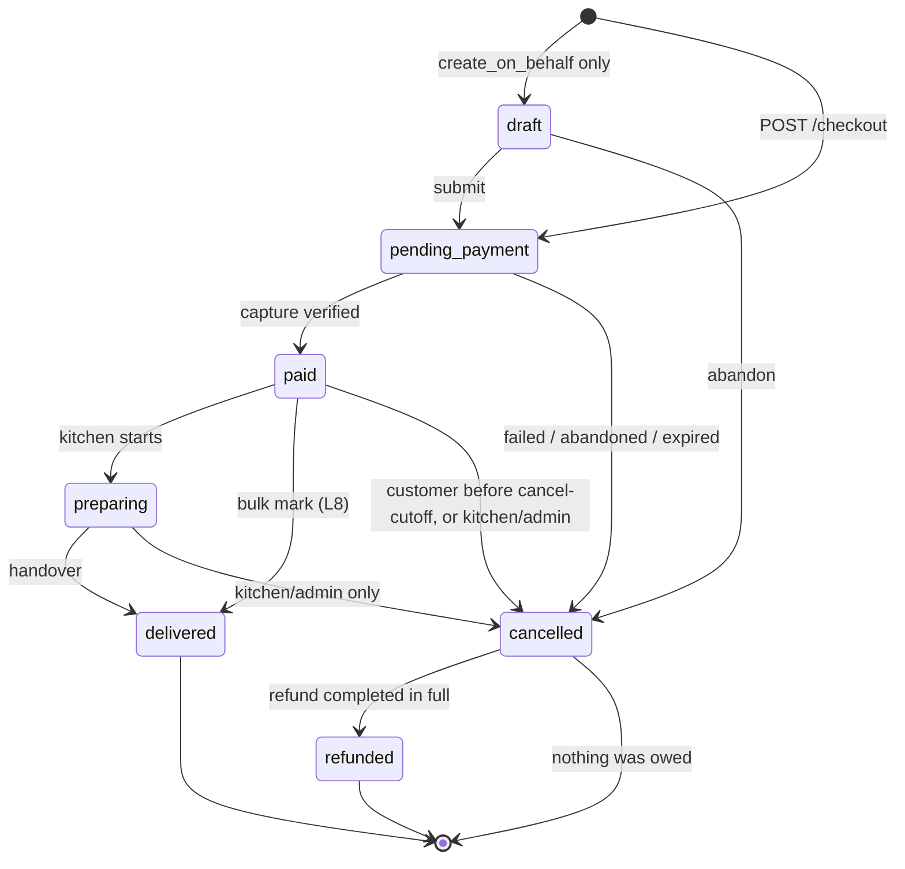

# Order lifecycle

The complete state machine for an order, the legal transitions, who may cause each one, and
what happens when the money path goes wrong. `docs/data-model.md` §7.6 defers to this
document; so does the `comment on column "order".status` in `0001_initial_schema.sql`.

**This document is normative for `E05-07`, `E05-11`, `E05-12`, `E06-02` … `E06-09` and
`E09-08`.** If the implementation needs to diverge from it, change this file in the same PR.

Everything here assumes the three-level shape — `order_group` → `"order"` → `order_line` —
which is `[DM-01]` and is **not settled**. §14 says exactly what collapses if Andy rules the
other way; the answer is "less than you would think", because the state machine lives on
`"order"` either way.

Nothing in this document may be built before **`E19-01`** (the Razorpay + UPI spike) returns.
Six statements below are marked **[verify in E19-01]** — they are the behaviours of Razorpay's
API and webhooks that this spec depends on and that could not be verified without a live
account. They are load-bearing. Do not treat them as facts.

---

## 1. Where state lives

| Level | Column | Who writes it | What it means |
|---|---|---|---|
| `order_group` | `status` (`order_group_status`) | **Derived only** — a trigger, never an Edge Function | The state of the *checkout*: did the money arrive, and has any of it gone back |
| `"order"` | `status` (`order_status`) | Edge Functions running as `service_role`, guarded by a transition trigger | The state of the *fulfilment unit*: one recipient, one service date, one break. **This is the state machine** |
| `order_line` | `status` (`order_line_status`) | Derived from `refunded_quantity` by a trigger | Per-dish refund state, so "one of the three sandwiches was unavailable" is expressible |
| `payment` | `status` (`payment_status`) | Webhook and verify handlers only | The state of one *attempt*. One row per attempt, never per order |
| `refund` | `status` (`refund_status`) | Refund handler and webhook | The state of one refund leg |

**`L1` — the order is the state machine; the group's status is derived and is never written
directly.** Two independently-writable status fields describing the same money is how you get
a group that says `paid` over three orders that say `cancelled`. The group's status is a
`SELECT` over its members plus its payments, materialised by trigger for query convenience.
The derivation is in §5.

`payment` is deliberately *not* part of the order state machine. An order is `paid` because
money was captured; the payment row records how. Coupling them — "the order status is the
payment status" — is what makes a refund unrepresentable, because a refunded payment does not
mean an undelivered lunch.

---

## 2. Actors

Five, matching the `actor_type` enum. Every transition names the actors permitted to cause it.

| `actor_type` | Who | How they reach the database |
|---|---|---|
| `customer` | The paying adult | `api/` → Edge Function → `service_role` (class 3 in `docs/authorization-model.md` §5.1) |
| `kitchen` | A back-office user holding a kitchen- or school-scoped grant | Same |
| `admin` | A `platform`-scoped grant holder | Same |
| `system` | A scheduled job or an internal handler with no human behind it | Same |
| `payment_provider` | Razorpay, via a signature-verified webhook | Same |

`"order"`, `order_group`, `order_line`, `order_event`, `payment`, `refund` and every `ledger_*`
table are **class 3** under `[AZ-01]` — `service_role` only, no write policy for
`authenticated` exists at all. There is therefore no path by which a customer's own SQL can
move an order between states; the authorization for every transition below is code in an Edge
Function plus the trigger in §4.4, not an RLS policy. That is deliberate and is the reason
`[AZ-01]` chose option (b): a status transition is a *computed* value, and RLS cannot
constrain a column.

---

## 3. The states

### 3.1 `order_status`

| State | Money | Kitchen sees it | Terminal | Meaning |
|---|---|---|---|---|
| `draft` | none | no | no | Composed but not submitted. **Unreachable in v1** — see §3.2 |
| `pending_payment` | none captured | no | no | Submitted, priced, cutoff-checked, waiting on the provider |
| `paid` | captured | **yes** | no | Money is in. This is the first state the kitchen may act on |
| `preparing` | captured | yes | no | Kitchen has started. Optional — see `L8` |
| `delivered` | captured | yes | **yes** | Handed over. Money may still move (a post-delivery refund) without leaving this state |
| `cancelled` | captured or not | no | no | Will not be delivered. A refund may or may not be owed |
| `refunded` | fully returned | no | **yes** | Cancelled *and* the whole order value has been returned |

Two states in this enum are not what their names suggest, and both are worth stating plainly:

- **`cancelled` is not terminal.** It is the waiting room for the refund. An unpaid order that
  is cancelled stays `cancelled` for ever; a paid order that is cancelled moves on to
  `refunded` when the refund completes.
- **`delivered` is terminal even when money moves afterwards.** A goodwill refund on a
  delivered order does not un-deliver it. See `[OL-04]`.

There is no `partially_refunded` in `order_status`, although both `order_group_status` and
`order_line_status` have one. That asymmetry is real and is `[OL-04]`.

There is no `payment_failed` in `order_status`, although `order_group_status` has one. That
asymmetry is **intentional and resolved**: a failed payment produces `order.status =
'cancelled'` with `cancel_reason_code = 'payment_failed'`, while the *group* — the checkout —
records `payment_failed` so the app can offer "try again" against the right object. The order
is a fulfilment unit and there is nothing fulfilment-shaped about a declined card.

### 3.2 Why `draft` is unreachable in v1

`[DM-09]` models the cart as client-only, so nothing server-side exists before checkout. The
checkout Edge Function inserts `"order"` rows directly at `pending_payment`. `draft` is kept
because:

- `orders.create_on_behalf` (`E06`-adjacent, support path) composes an order before submitting
  it;
- the `[DM-09]` alternative — a server-side cart — would populate it;
- `order.status` defaults to `'draft'` in the DDL, and an insert that omits `status` must land
  somewhere legal rather than somewhere impossible.

The transition trigger therefore permits `NULL → draft` and `NULL → pending_payment` as
creation, and `draft → pending_payment`. **v1 emits no `draft` rows.** A monitoring assertion
that counts them is cheap and would catch an insert that forgot to set `status`.

### 3.3 The other three enums

**`order_group_status`** — `draft`, `pending_payment`, `paid`, `payment_failed`, `cancelled`,
`refunded`, `partially_refunded`. Derived (§5).

**`order_line_status`** — `ordered` → `cancelled` | `partially_refunded` → `refunded`. Derived
from `refunded_quantity` versus `quantity` by trigger. `cancelled` is used when the whole order
is cancelled before any money moves; `refunded` when `refunded_quantity = quantity`.

**`payment_status`** — `created`, `authorized`, `captured`, `failed`, `refunded`,
`partially_refunded`. §6.

**`refund_status`** — `pending`, `processing`, `completed`, `failed`. §7.

---

## 4. `order_status` — the state machine



### 4.1 Legal transitions

Every legal transition, exhaustively. Anything not in this table is rejected by the trigger in
§4.4 with `SQLSTATE 23514` and a message naming both states.

| # | From | To | Actors | Guard | Side effects, in the same transaction |
|---|---|---|---|---|---|
| **T1** | *(insert)* | `draft` | `admin` | Holder of `orders.create_on_behalf` | `order_event(null → draft)` |
| **T2** | *(insert)* | `pending_payment` | `system` | All of §8.2's pre-flight guards passed | `order_event(null → pending_payment)`; `placed_at = now()` |
| **T3** | `draft` | `pending_payment` | `admin`, `customer` | Same guards as T2, re-evaluated | `placed_at = now()` |
| **T4** | `draft` | `cancelled` | `admin`, `customer`, `system` | — | `cancelled_at`, `cancel_reason_code` |
| **T5** | `pending_payment` | `paid` | `system`, `payment_provider` | A `captured` payment exists for the group **or** `order_group.payable_paise = 0` and the wallet leg posted | `confirmed_at`; allocate `pickup_code` (§9.4); allocate the invoice number and write the invoice (`D14`, `M3`); post the sale to the ledger; enqueue `E08-03` |
| **T6** | `pending_payment` | `cancelled` | `system`, `customer`, `admin` | No capture, **and** every payment attempt for the group is terminal at the provider (§10.5) | `cancelled_at`, `cancel_reason_code ∈ {payment_failed, customer_cancelled, checkout_expired}`; reverse the wallet leg (§9.3) |
| **T7** | `paid` | `preparing` | `kitchen`, `admin` | — | `preparing_at`; enqueue `E08-04` |
| **T8** | `paid` | `delivered` | `kitchen`, `admin` | Holder of `orders.mark_delivered` | `delivered_at`, `delivered_by_user_id`; enqueue `E08-05` |
| **T9** | `preparing` | `delivered` | `kitchen`, `admin` | Holder of `orders.mark_delivered` | As T8 |
| **T10** | `paid` | `cancelled` | `customer` | `now() < cutoff_at − customer_cancellation_cutoff_minutes` **and** `customer_cancellation_allowed` | `cancelled_at`, `cancelled_by_user_id`, `cancel_reason_code = 'customer_cancelled'`; raise a refund (§7) |
| **T11** | `paid` | `cancelled` | `kitchen`, `admin` | Holder of `orders.cancel`. No time bound | As T10, with the staff reason code (`E09-08`) |
| **T12** | `preparing` | `cancelled` | `kitchen`, `admin` | Holder of `orders.cancel` | As T11 |
| **T13** | `cancelled` | `refunded` | `system` | `refunded_total_paise = total_paise` and every contributing `refund.status = 'completed'` | Enqueue `E08-06`; credit note (`E07-07`) |

### 4.2 Notable illegal transitions, and why

| Rejected | Why it must be rejected |
|---|---|
| `pending_payment → preparing` / `→ delivered` | The kitchen must never cook against money that has not arrived. `L5` |
| `paid → refunded` directly | A refund without a cancellation loses *why* the food was not delivered. Go through `cancelled`, which carries `cancel_reason_code` |
| `delivered → cancelled` | The food was eaten. A post-delivery problem is a refund, not a cancellation. `[OL-04]` |
| `delivered → refunded` | Same. This is the one people will argue about; the argument is in `[OL-04]` |
| `cancelled → paid` | A late capture against a cancelled order is a refund, not a resurrection. §10.5 |
| `refunded → *` | Terminal. A further movement is a new `ledger_transaction`, not a state change |
| `paid → pending_payment` | There is no un-capturing. A reversal is a refund |
| `* → draft` | `draft` is a creation state only |

### 4.3 Guards that are *not* on `order.status`

Three things people expect to be states and which are not:

- **"Awaiting the provider".** That is `payment.status = 'created'`, on the attempt. The order
  is `pending_payment` for the whole of it, however many attempts it takes.
- **"Partially refunded".** That is `order.refunded_total_paise > 0` and
  `order_line.status = 'partially_refunded'`. `[OL-04]`.
- **"Out for delivery".** `E08-04` names it, but `P4`'s delivery model is a bulk mark per class
  and a pickup code at a counter — there is no vehicle to track. `preparing` covers it.

### 4.4 The enforcing trigger

`E06-05`. One `BEFORE INSERT OR UPDATE OF status ON "order"` trigger, plus an `AFTER` trigger
that writes the history row.

**`L2` — the transition table is hard-coded in the trigger function, not a table.** Which
transitions are legal is not configuration. A `order_status_transition` table would be data,
and data is editable by anyone holding the right grant; the point of the trigger is that no
grant can make `pending_payment → delivered` happen.

```
create or replace function assert_order_status_transition() returns trigger
language plpgsql as $$
declare
  v_actor_type actor_type;
  v_legal boolean;
begin
  if tg_op = 'UPDATE' and new.status = old.status then
    return new;                       -- not a transition; other columns may change freely
  end if;

  -- Actor context arrives on transaction-local GUCs set by the Edge Function.
  -- current_setting(..., true) returns null instead of raising when unset.
  v_actor_type := nullif(current_setting('app.actor_type', true), '')::actor_type;
  if v_actor_type is null then
    raise exception 'order status change with no app.actor_type set (order %)', new.id
      using errcode = '23514';
  end if;

  v_legal := (tg_op, coalesce(old.status::text, ''), new.status::text, v_actor_type::text)
             in ( ... the §4.1 table, literal ... );

  if not v_legal then
    raise exception 'illegal order transition % -> % by % (order %)',
      coalesce(old.status::text, '(new)'), new.status, v_actor_type, new.id
      using errcode = '23514';
  end if;
  return new;
end $$;
```

Four things about it that are easy to get wrong:

1. **`INSERT` and `UPDATE` are different cases.** On insert `OLD` is null and the legal set is
   `{draft, pending_payment}`. A trigger written only for `UPDATE` lets any insert create a
   `delivered` order.
2. **It must not be `SECURITY DEFINER`.** Same rule as `auth_is_privileged_role()` in
   `docs/authorization-model.md` §6.1 and the same reason: a function whose answer depends on
   who is calling must run with invoker rights.
3. **The actor arrives on a GUC, not as an argument**, because a trigger cannot see the HTTP
   caller. Every Edge Function that touches order status opens with
   `select set_config('app.actor_type', $1, true)` and `set_config('app.actor_user_id', $2, true)`
   — transaction-local, so it cannot leak into the next request on a pooled connection. The
   `true` third argument is what makes it `SET LOCAL`; without it the setting outlives the
   transaction and the next request on that connection inherits the wrong actor.
4. **The `AFTER` trigger writes `order_event`, not the Edge Function.** `I2` in §12 asserts
   one event per transition; that is only true if the writing is not optional. The event's
   `reason_code`, `note` and `metadata` come from `app.reason_code` / `app.note` GUCs set the
   same way. `order_event` is append-only — `UPDATE` and `DELETE` are revoked from every
   application role (§7.5 of the data model).

The migration that adds this trigger must set `app.actor_type = 'system'` around any backfill,
including `E16`'s data migration, or every migrated order fails to insert.

---

## 5. `order_group_status` — derivation

Evaluated by an `AFTER INSERT OR UPDATE` trigger on `"order"`, on `payment` and on `refund`,
in that group's row lock. First matching rule wins.

| # | Condition | Group status |
|---|---|---|
| G1 | Any member is `draft`, none is beyond `draft` | `draft` |
| G2 | No `captured` payment exists and at least one member is `pending_payment` | `pending_payment` |
| G3 | No `captured` payment exists and every member is `cancelled` with `cancel_reason_code = 'payment_failed'` | `payment_failed` |
| G4 | No `captured` payment exists and every member is `cancelled` (any other reason, e.g. `checkout_expired` or `customer_cancelled`) | `cancelled` |
| G5 | A `captured` payment exists, `Σ completed refunds = captured amount`, and every member is `cancelled` or `refunded` | `refunded` |
| G6 | A `captured` payment exists and `Σ completed refunds > 0` | `partially_refunded` |
| G7 | A `captured` payment exists | `paid` |

Note G6 sits above G7 deliberately: a group with a completed partial refund is
`partially_refunded` even though most of it is still going to be delivered. The kitchen does
not read the group status; the customer's order list and the reconciliation report do.

G3 sits above G4 for the same "first match wins" reason: a group whose members were all
cancelled with `cancel_reason_code = 'payment_failed'` derives to `payment_failed`, and any
other all-cancelled group (including `checkout_expired`) derives to `cancelled`. This is
reachable — the §10.4 sweeper writes `payment_failed` to every member when any `payment`
attempt reached `failed`, and `checkout_expired` only when nothing was ever attempted (§10.4
step 3). §12.1 scenario 5 relies on exactly this split.

`Σ completed refunds` **excludes `failed` refunds**, and so must the over-refund guard — see
§7.3, which corrects the constraint as stated in `docs/data-model.md` §8.3.

---

## 6. `payment_status` — attempts, and the monotonicity rule

One `payment` row **per attempt**. A customer who fails on UPI and retries on card produces two
rows against one `order_group`, and both are needed for `E06-06` and for the `E06-11`
reconciliation.

```
created ──> authorized ──> captured ──> partially_refunded ──> refunded
   │            │              │
   └──> failed  └──> failed    └─────────────────────────────> refunded
```

### 6.1 Legal transitions

| From | To | Cause |
|---|---|---|
| *(insert)* | `created` | The Razorpay order was created and the attempt handed to the client |
| `created` | `authorized` | `payment.authorized` webhook. Only under manual capture — see `[OL-01]` |
| `created` | `captured` | `payment.captured` webhook, or a verified `/verify` call |
| `created` | `failed` | `payment.failed` webhook, the client failure callback, or the §10.4 sweeper |
| `authorized` | `captured` | Capture call succeeded |
| `authorized` | `failed` | Authorization expired without capture |
| `captured` | `partially_refunded` | `Σ completed refunds` against it is `> 0` and `< amount_paise` |
| `captured` | `refunded` | `Σ completed refunds = amount_paise` |
| `partially_refunded` | `refunded` | As above |

### 6.2 The monotonicity rule

**`L3` — payment state is monotonic on a capture rank, and the refund axis is derived, not
transitioned.**

```
rank: created = 0, authorized = 1, captured = 2, failed = 3 (terminal from 0 or 1 only)
```

A webhook or callback that implies a rank **lower than or equal to** the current rank is
recorded in `payment_webhook_event` (with `processing_status = 'ignored'`) and changes nothing.
Once `status = 'captured'`, the status is recomputed from `Σ` completed refunds against that
payment, never from an inbound event's own status string.

This exists because **webhook delivery is not ordered.** `payment.authorized` arriving after
`payment.captured` is normal, not an error, and a handler that does `update payment set status
= <event status>` will silently downgrade a captured payment to authorized — after which the
order is `paid`, the invoice is issued, and the reconciliation job reports a hole. The failure
is invisible until month end. **[verify in E19-01]** — confirm Razorpay's actual event set and
whether it guarantees any ordering; assume it does not.

`failed` is terminal and is *not* reachable from `captured`. If a `payment.failed` arrives for
a captured payment, that is a provider-side contradiction: record it, do nothing, and raise the
`E15-05` alert.

### 6.3 Which events are handled

| Razorpay event | Effect |
|---|---|
| `payment.authorized` | Rank 1. Under auto-capture (`[OL-01]`) this is informational only |
| `payment.captured` | Rank 2 → `settle_payment()` (§8.4) |
| `payment.failed` | Rank 3 → close the attempt, leave the group open for a retry |
| `order.paid` | Treated as a duplicate of `payment.captured`; idempotent, so harmless |
| `refund.created` | `refund.status = 'processing'`, store `provider_refund_id` |
| `refund.processed` | `refund.status = 'completed'` → §7.2 |
| `refund.failed` | `refund.status = 'failed'` → alert (`E15-05`), admin path |
| `refund.speed_changed` | Informational; record only |
| anything else | Recorded with `processing_status = 'ignored'`. **Never an error** — an unknown event type must not 500, because Razorpay will retry it for ever |

**[verify in E19-01]** — this event list, and whether `order.paid` fires for every capture.

---

## 7. `refund_status`

```
pending ──> processing ──> completed
   │            │
   └──> failed  └──> failed
```

### 7.1 Wallet refunds are synchronous

`M7` makes wallet the default destination. A `destination = 'wallet'` refund has **no provider
leg**: it is inserted at `pending` and moved to `completed` in the same transaction, with the
ledger posting and the `wallet_balance` update alongside it. `payment_id` is null. The customer
sees the balance immediately, which is the whole point of `M7`.

### 7.2 Source refunds are asynchronous

`pending` → (Razorpay refund created, `provider_refund_id` set) → `processing` → `completed` on
the `refund.processed` webhook. T+5 days is normal. The order does **not** reach `refunded`
(T13) until the refund is `completed`, so a customer whose refund is in flight sees `cancelled`,
not `refunded`. That is honest and matches their bank statement.

### 7.3 `failed` is terminal; a retry is a new row

A failed refund is never re-attempted in place. Reasons: `provider_refund_id` is unique where
not null, so a retry needs a new row anyway; and reconciliation wants one row per provider
interaction.

**This corrects `docs/data-model.md` §8.3.** That section states the over-refund guard as
"`Σ refund.amount_paise` for a group must not exceed the group's captured amount". Taken
literally that is wrong in both directions:

- it counts `failed` refunds, so two failed attempts on a full refund would block the third,
  legitimate one;
- it does not count in-flight (`pending` / `processing`) refunds, so two admins refunding the
  same order at the same time both pass the check.

The guard is:

```
Σ amount_paise WHERE status IN ('pending', 'processing', 'completed')  ≤  captured amount
```

evaluated in a constraint trigger that takes the `order_group` row lock first, so the two-admin
race serialises. `E06-21` owns the correction. The same sum, restricted to `completed`, is what
`order.refunded_total_paise` and `order_line.refunded_quantity` are maintained from.

### 7.4 MDR

`M5`: Razorpay does not return the MDR on a refund, and the loss comes out of the school's
share. `refund.mdr_paise` and `refund.mdr_borne_by` record it; the ledger posting debits
`school:<id>:payable`. `E07-11`. Nothing in the order state machine depends on it.

---

## 8. The checkout path, step by step

This is the money-critical sequence. Every step names its transaction boundary, because where
the commits fall is the whole design.

### 8.1 Phase 0 — pre-flight (optional, UX only)

`POST /checkout/preflight`. Runs every guard in §8.2 and returns the server's prices without
writing anything. Purely so the app can show "the cutoff for Tuesday has passed" *before* the
user taps Pay. **It is not a guard.** Everything is re-evaluated inside the checkout
transaction; a pre-flight result is stale the moment it is returned. `E05-13`.

### 8.2 Phase 1 — create the checkout *(one transaction)*

`POST /checkout`, header `Idempotency-Key`, body carries the cart and
`expected_total_paise`. Runs as `service_role`.

1. `begin`
2. Insert into `idempotency_key` with `scope = 'checkout'`. A unique violation means this is a
   replay: if `request_hash` matches, return the stored `response_body` verbatim and stop; if
   it does not, return `409 idempotency_key_reused`. `E05-12`.
3. Resolve the effective config per school (`D5`, `resolve_effective_config`). Compute
   `cutoff_at` per member order (§9.1).
4. **Revalidate every line against live data**: the menu item is still assigned to that school
   for that `service_date`, the price is the server's price, the allergen and food-type
   snapshots are today's, the delivery mode is permitted, and — if `E02-12`'s counter is in use
   (`P3`) — decrement `menu_item_capacity.remaining` atomically.
5. **Authorization**: every `recipient_id` reaches the caller through a `guardian_link` with
   `can_order = true`. This is the one guard that is *not* also enforced by RLS, because the
   function runs as `service_role` — so it is explicitly asserted here and explicitly tested.
6. **Guards** (all must hold, all evaluated against `now()` from Postgres):
   `now() < cutoff_at` for **every** member order; `service_date` within
   `[min_advance_order_days, max_advance_order_days]`; the school is onboarded; the recipient is
   not soft-deleted.
7. Compute the money: line subtotal, the CGST/SGST split per `M2`, order totals, group totals.
   Every value integer paise.
8. **Compare the computed group total against `expected_total_paise`.** A mismatch aborts with
   `price_changed` and the new total. `L7`, `[OL-06]`.
9. Insert `order_group` (status `pending_payment`, `correlation_id` generated here and copied
   everywhere), the `"order"` rows (status `pending_payment`, `cutoff_at` and `config_snapshot`
   snapshotted, all `*_snapshot` columns filled), and the `order_line` rows.
10. **Apply the wallet** if `wallet_applied_paise > 0` (`E06-10`):
    `update wallet_balance set balance_paise = balance_paise - :w where user_id = :u and
    balance_paise >= :w`. Zero rows affected means insufficient balance — abort. Post the hold
    to the ledger: **debit** `user:<id>:wallet`, **credit** `platform:suspense`. It is a hold,
    not a sale; the sale is not recognised until capture.
11. `commit`

### 8.3 Phase 2 — create the provider order *(outside the transaction)*

Call Razorpay's Orders API for `payable_paise`, with `receipt = order_group.id` so a retry is
idempotent at their end **[verify in E19-01]**. Insert the `payment` row at `created` with
`attempt_no = (max for this group) + 1`.

**The database commit comes first, deliberately.** The two orderings fail differently:

- *Razorpay first* → a Razorpay order that no row in our database knows about. If the
  subsequent commit fails, the customer can be charged against an order we have no record of.
  Unrecoverable without a manual reconciliation against their dashboard.
- *Database first* → an `order_group` at `pending_payment` with no `payment` row. The customer
  sees "payment could not be started", retries with the same idempotency key, gets the same
  group back, and a second attempt is created. The §10.4 sweeper closes it if they never do.

The second is strictly recoverable and the first is not. `L4`.

If `payable_paise = 0` — the whole checkout covered by wallet — **there is no provider leg at
all.** Skip straight to §8.4 with the wallet hold as the settlement input.

### 8.4 Phase 3 — settlement *(one transaction, idempotent)*

Two independent paths converge on one function, `settle_payment(provider_payment_id)`:

- **(a) the client callback.** The app receives Razorpay's success handler and calls
  `POST /checkout/:group/verify`. The handler verifies the HMAC signature (`E06-03`) and then
  **fetches the payment from Razorpay's API** rather than trusting the posted body. A verified
  signature proves the body was not tampered with; it does not prove the payment succeeded, and
  the client is not a source of truth about money (`E06-03`, "never trust client-reported
  status").
- **(b) the webhook.** `payment.captured` arrives, the signature is verified against the webhook
  secret, and the event is inserted into `payment_webhook_event`. **The unique constraint on
  `(provider, provider_event_id)` is the idempotency guarantee** (`D16`) — a unique violation
  means "already seen, stop", before any work is done.

Both take `pg_advisory_xact_lock(hashtext(order_group_id::text))` as their first statement, so
the race between a fast callback and a fast webhook serialises rather than double-settling.

`settle_payment` then, in one transaction:

1. Apply the §6.2 monotonicity rule to the `payment` row. If it is already `captured`, return —
   this is a replay, and returning is the correct behaviour, not an error.
2. **If a *different* payment for this group is already `captured`** → the duplicate path,
   §10.6.
3. Transition every member order `pending_payment → paid` (T5). The trigger writes the events.
4. Allocate `pickup_code` per order where `delivery_mode = 'counter'` and `pickup_code_enabled`
   (§9.4).
5. Allocate the invoice number from the `invoice_sequence` counter row with
   `UPDATE … RETURNING` inside this transaction (`D14`, `M3` — never a `SEQUENCE`), and write
   `invoice` + `invoice_line`. One invoice per group (`[DM-02]`). The issuer refuses to allocate
   a number while `seller_gstin` or `sac_code` is still a placeholder (`E07-13`,
   `docs/gst-invoicing.md` §2) — but this is **defence in depth only**. Reaching it in
   production means the money is already captured (step 3 has run), so the refusal rolls this
   transaction back and strands a captured payment; the *primary* guard is `E07-20`'s refusal at
   `POST /checkout` (§8.2), which fails **before** authorization, plus a boot assertion on the
   payments Edge Functions. This allocation-time check must never be the only one that fires.
6. Post the sale to the ledger (`[DM-03]`, double-entry): **debit** `provider:razorpay:clearing`
   for `payable_paise` and **debit** `platform:suspense` for the wallet portion; **credit**
   `platform:revenue` for the taxable value and `platform:tax_payable:cgst` / `:sgst` for the
   tax. Then post the MDR in a separate transaction (`reason_code = 'provider_fee'`): **debit**
   `platform:provider_fees` and **credit** `provider:razorpay:clearing` for the fee plus its
   GST, so the clearing account holds only what Razorpay will actually settle. Omitting it
   overstates clearing permanently by the MDR — see `docs/payments-design.md` §10 note 3 and
   posting #3; `E06-22` seeds the `sale` and `provider_fee` reason codes this step needs.
   `ledger_transaction`'s unique `(source_type, source_id, reason_code)` makes each posting
   itself idempotent (`D16`).
7. Set `order_group.paid_at`; the derivation trigger takes the group to `paid`.
8. Enqueue notifications (`E08-03` — push and email, with the pickup codes).

Everything in 3–8 is idempotent by a database constraint rather than by a flag: the transition
trigger, `uq_invoice_one_tax_invoice_per_group`, `ledger_transaction_source_unique` and
`uq_order_pickup_code` each independently refuse a second run.

---

## 9. Cutoff

`E05-07`, risk critical. The single rule, `L6`: **enforcement always compares `now()` (from
Postgres) against `order.cutoff_at`, the value snapshotted when the order was written, and
never against a re-resolution of the config or a client clock.** Follows `D5`. An admin
changing the cutoff at 9pm cannot retroactively invalidate an order placed at 8pm.

### 9.1 Computing `cutoff_at`

```
cutoff_at = (service_date − order_cutoff_days_before)  at  order_cutoff_time
            in the timezone from the resolved config
```

Resolved through the config chain platform → kitchen → school (`D5`). Written to
`order.cutoff_at`; the whole resolved row goes to `order.config_snapshot`.

### 9.2 The five enforcement points

| # | Where | Authoritative | Notes |
|---|---|---|---|
| **E1** | The app's calendar (`E05-08`) greys out closed days | **No** | A client clock is not evidence. Purely UX |
| **E2** | `POST /checkout/preflight` | No | Advisory; §8.1 |
| **E3** | Inside the checkout transaction, §8.2 step 6 | **Yes** — for order creation | `now() < cutoff_at`, strict |
| **E4** | At settlement, §8.4 | **`[OL-02]` — undecided** | The cutoff can pass while the payment is in flight. This is the sharpest edge case in the document |
| **E5** | Customer cancellation (T10) | **Yes** | `now() < cutoff_at − customer_cancellation_cutoff_minutes` |

Kitchen and admin actions (T7, T8, T9, T11, T12) are **never** cutoff-bound. The cutoff protects
the kitchen's lead time; staff do not need protecting from themselves.

### 9.3 Edge cases

| # | Case | Behaviour |
|---|---|---|
| **C1** | Exactly at `cutoff_at` | **Closed.** The comparison is `now() < cutoff_at`, strict. State it in the test |
| **C2** | Clock authority | Postgres `now()`, evaluated inside the guarding statement. Never `Date.now()` in the Edge Function, never the device clock. One clock, one place |
| **C3** | Timezone | The resolved config timezone, default `Asia/Kolkata`. India has **no DST** and has been a fixed +05:30 since 1945, so the usual "cutoff moved by an hour" class of bug does not exist here — but only because the arithmetic is done in a named timezone rather than in a fixed offset. Do not hard-code `+05:30` |
| **C4** | A parent ordering from abroad | Their device clock and timezone are irrelevant at every point that matters (C2). The app must render `cutoff_at` in the *school's* timezone with the timezone shown, or a parent in London will read "midnight" as their own |
| **C5** | **What "midnight cutoff" actually means** | The defaults are `order_cutoff_time = '00:00'`, `order_cutoff_days_before = 0`. So the cutoff for Monday's lunch is **00:00 on Monday** — i.e. you must order by Sunday night. This is the intended reading of `D5` but it is easy to misread as "23:59 on the service day", which would be a whole day wrong. The worked example belongs in the test |
| **C6** | `min_advance_order_days = 0` | **Dead config under the default cutoff.** Same-day ordering requires `now() < today 00:00`, which is never true. It is not a bug — the two settings are independent and a kitchen with `order_cutoff_time = '09:00'` would make same-day ordering real — but nobody should read the `0` default as "same-day ordering is on" |
| **C7** | A group spanning several service dates (`[DM-01]`) | Each member order has its **own** `cutoff_at`. Checkout requires **every** member to be open (§8.2 step 6); the binding constraint is the earliest. There is no partial checkout — the cart is accepted whole or rejected whole, and the rejection names the offending service dates so the app can offer to drop them |
| **C8** | Admin changes the cutoff between cart-build and checkout | The client's cached cutoff is advisory. The checkout transaction resolves it fresh, and a cart that was buildable at 22:00 can be rejected at 22:05 with `cutoff_passed`. The app must handle that rejection, not assume it cannot happen |
| **C9** | Admin *shortens* the cutoff while orders sit at `pending_payment` | Those orders keep the cutoff they snapshotted. Deliberate, and the same rule as C8 from the other side |
| **C10** | The service date is a school holiday | `P2` — there is no holiday calendar in v1. The order succeeds and is cancelled and refunded by kitchen or admin with `reason_code = 'school_holiday'`. Do not build blocking logic for it |
| **C11** | `customer_cancellation_cutoff_minutes = 0` (the default) | Cancellation closes at exactly the same instant as ordering. So the last minute before cutoff is both orderable and cancellable, and one second later neither |
| **C12** | Cutoff passes while an order is `paid` but not `preparing` | Nothing happens. The cutoff bounds *creation* and *customer cancellation* only |

### 9.4 Pickup codes

`P4`, `[DM-10]`. Allocated at T5 — **on capture, not at checkout**. An abandoned checkout must
not consume a code, and a code that exists before money does is a code that can be quoted at a
counter for an order nobody paid for.

Four digits, unique per `(school_id, service_date)` — 10,000 values against a few hundred orders
per school-day, so allocation is: pick a random unused code, insert, and on unique violation
retry (bounded at ~10 attempts, then widen to a linear scan). `uq_order_pickup_code` is the
guarantee. `[DM-10]` is the standing warning that four digits are guessable and that staff must
match the name shown on screen as well as the code.

---

## 10. Failure paths

The eight scenarios `E06-06` names, plus the ones that turned up while writing this.

### 10.1 The payment explicitly fails

`payment.failed`, or the client's failure callback. The `payment` row goes to `failed`. **The
order group stays at `pending_payment`** and the orders stay at `pending_payment` — the customer
is expected to retry, and a retry against the same group is a new `payment` row with
`attempt_no + 1`, not a new checkout.

Retry is refused, and the group closed instead, if the cutoff has since passed on any member.

### 10.2 The customer dismisses the payment sheet

Indistinguishable from 10.1 without a client signal, and the client signal is not trustworthy.
The group is left open and the §10.4 sweeper deals with it. The app should offer "resume
payment" on the order list for any group at `pending_payment` — that is the same endpoint as
10.3.

### 10.3 App killed mid-payment

The hard one, and the reason `L3` exists. Three facts make it survivable:

1. The webhook is a **second, independent path** to settlement. The app being dead does not stop
   `payment.captured` arriving and the order becoming `paid` with the confirmation email sent.
2. On next launch, the app calls `GET /checkout/:group/status` for every locally-known group
   that is not terminal. That endpoint **reconciles against Razorpay** — it fetches the provider
   order and its payments rather than reporting our own stale row — and settles if a capture
   happened. `E06-16`.
3. The §10.4 sweeper is the backstop for a customer who never opens the app again.

The app must therefore persist `order_group_id` locally *before* opening the Razorpay sheet.
An app killed between "create checkout" and "persist the id" is handled by 10.4 alone, which is
why the sweeper is not optional.

### 10.4 Nothing ever comes back — the abandoned checkout sweeper

A scheduled job, every 5 minutes. For each `order_group` at `pending_payment` older than the TTL
(`[OL-03]`):

1. For every non-terminal `payment` attempt, **ask Razorpay** what happened. Do not decide from
   the clock alone. A UPI collect request can sit pending for minutes, and closing a checkout
   whose payment is about to succeed is how you create §10.5.
2. If any attempt captured → run `settle_payment()`. It is late but correct.
3. If no attempt captured, close the group with T6 for every member order, reverse the wallet
   hold (§10.7), and release any capacity decrement. **The reason code splits on whether the
   customer ever actually tried to pay:**
   - **Any `payment` attempt reached `failed`** (a declined card, a rejected UPI collect) →
     `cancel_reason_code = 'payment_failed'`. This is the case §3.1 and rule G3 mean by a failed
     checkout, and it is what makes `order_group_status = 'payment_failed'` reachable — see the
     note below.
   - **No attempt was ever made, or every attempt is still non-terminal past the TTL** (the
     customer opened checkout and walked away, or the sheet never returned) →
     `cancel_reason_code = 'checkout_expired'`.

   Both land on T6, whose guard already admits either code. The distinction is not cosmetic: it
   is the difference between "your card was declined, try again" and "this checkout timed out",
   and it is the only thing that lets rule G3 (§5) ever match. Without the split, every swept
   group would carry `checkout_expired`, G3 could never fire, and `payment_failed` would be a
   dead status. `E06-30` implements the split.

**[verify in E19-01]** — how long a UPI collect request can remain pending, and whether Razorpay
expires it itself. That number sets the TTL floor.

### 10.5 A capture arrives after the group was closed

The genuinely nasty one: the sweeper cancelled at T+30, the late UPI capture lands at T+35. The
money is real and the orders are cancelled.

`cancelled → paid` is illegal (§4.2) and must stay illegal — resurrecting an order whose cutoff
may have passed would put an unmakeable meal on the kitchen's list. So:

1. Record the payment as `captured`. The money happened; the database must say so.
2. Raise an **automatic full refund** with `reason_code = 'checkout_expired'`, destination per
   `refund_default_destination` (wallet by default, `M7`).
3. Alert (`E15-05`). Every occurrence is either a TTL set too short or a provider behaviour we
   have modelled wrongly, and both want a human to look.

§10.4's rule — reconcile before cancelling — is what keeps this rare. It cannot make it
impossible, so the path exists.

### 10.6 Duplicate payment

Two different shapes, and only one of them is handled today.

**(a) The same event delivered twice.** Razorpay retries webhooks. Handled entirely by
`payment_webhook_event`'s unique `(provider, provider_event_id)` and by
`uq_payment_provider_payment_id`. Nothing to build; `E06-04` is a test, not a mechanism.

**(b) Two genuinely different captures against one `order_group`.** Attempt 1 is a UPI collect
sitting pending; the customer gives up and pays by card; attempt 1 then succeeds. Two real
debits, one cart. This *will* happen.

`uq_payment_one_capture_per_group` — `unique (order_group_id) where status = 'captured'` — is
`D16`'s guarantee that we never treat two payments as settling one checkout. It is right, and it
has a consequence nobody wrote down: **the second capture cannot be recorded at all.** The
insert or update to `captured` fails, so the correct behaviour ("record it, then refund it") is
the one thing the schema forbids. That is `[OL-05]`, and it needs a schema change before
`E06-06` can be built.

Once that lands, the path is: record the duplicate → immediately raise a full refund for it with
`reason_code = 'duplicate_payment'` (already seeded) → alert. Refund to **source**, not wallet,
overriding `M7`: a customer who was charged twice wants their money back, not credit. The order
state machine does not move at all — the first capture already settled it.

### 10.7 Wallet applied, provider leg fails

The wallet hold from §8.2 step 10 is reversed as soon as the group is closed (T6), by a
`reversal_of_transaction_id` posting — a correction is a reversal, never an edit
(`ledger_transaction`'s comment). `wallet_balance` is updated in the same transaction, per
`[DM-04]`. The nightly assertion that every wallet row equals the sum of its ledger entries
(riding along with `E06-11`) is what catches a reversal that was missed.

A hold must **never** be left outstanding against a dead checkout. `E06-19`.

### 10.8 A webhook with a bad signature

Recorded with `signature_verified = false` and **never acted on** (`0001`'s comment on the
column). Return `200`, not `401` — a `4xx` makes Razorpay retry a request we will never accept.
Raise the `E15-05` alert: a burst of signature failures is an attack signal, and recording it is
the point.

### 10.9 A webhook for an unknown order

Almost always the other environment's Razorpay account hitting this one's URL (`A7`, `E06-14`).
Record with `processing_status = 'ignored'`, return `200`, alert. Never 500 — Razorpay will
retry it for ever and the retry storm will bury the real events.

### 10.10 The Razorpay Orders API call fails (§8.3)

The group sits at `pending_payment` with no `payment` row. The customer retries with the same
`Idempotency-Key`, gets the same group back, and a new attempt is created. If they never retry,
§10.4 closes it. This is the recoverable half of `L4`.

### 10.11 A dish becomes unavailable after payment

`E09-08`. Not a payment failure — a fulfilment failure. Kitchen cancels the order (T11) or
issues a **per-line** refund (`E06-08`) leaving the rest of the order to be delivered. The order
stays `paid`; the line goes to `refunded`; `order.refunded_total_paise` rises; the group becomes
`partially_refunded` (G6). A credit note follows (`E07-07`).

### 10.12 A refund fails at the provider

`refund.failed` → `refund.status = 'failed'` (terminal, §7.3) → alert (`E15-05`). An admin
raises a new refund, typically to wallet. The order stays `cancelled` and does **not** reach
`refunded`, which is correct: the customer has not had their money back.

---

## 11. Scheduled jobs this specification requires

| Job | Cadence | What it does | Task |
|---|---|---|---|
| Abandoned-checkout sweeper | 5 min | §10.4 | `E05-14` |
| In-flight payment reconciler | 15 min | Any `payment` at `created`/`authorized` past the TTL — ask Razorpay, settle or fail it | `E06-17` |
| In-flight refund reconciler | hourly | Any `refund` at `pending`/`processing` older than the expected window — ask Razorpay | `E06-17` |
| Webhook retry | 5 min | `payment_webhook_event` at `pending`/`failed` — the partial index `ix_payment_webhook_event_retry` exists for exactly this | `E06-04` |
| Daily reconciliation | daily | Razorpay settlement report vs the ledger; wallet rows vs ledger sums (`[DM-04]`) | `E06-11` |
| Idempotency key purge | daily | 24h TTL on `idempotency_key` | `E01` |

---

## 12. Invariants

Each one is a test, and each one fails loudly. `E06-13` supplies the payment fixtures.

| # | Invariant | How it is checked |
|---|---|---|
| **I1** | No `"order"` is `paid`, `preparing` or `delivered` unless its group has a `captured` payment **or** `payable_paise = 0` with a posted wallet settlement | Query assertion in the reconciliation job + pgTAP |
| **I2** | Every status change has exactly one `order_event`, and every `order_event` describes a §4.1-legal transition | Trigger writes it (§4.4); pgTAP replays every row through the legality function |
| **I3** | `Σ order.total_paise` over a group equals the group's `subtotal + tax − discount` | Deferred constraint trigger, already in `0001` |
| **I4** | `order.refunded_total_paise = Σ` completed refunds attributable to that order, and `≤ total_paise` | `CHECK` for the bound; trigger-maintained for the equality; asserted nightly |
| **I5** | `Σ` refunds at `pending`/`processing`/`completed` for a group `≤` the group's captured amount | Constraint trigger, §7.3 |
| **I6** | No `invoice` exists for a group that has never had a `captured` payment | pgTAP; `M3` — failed payments must not burn invoice numbers |
| **I7** | Invoice numbers are gapless within a financial year | `E07-01`; `invoice_fy_sequence_unique` plus a gap query |
| **I8** | `wallet_balance.balance_paise = balance(user:<id>:wallet)`, where the wallet is a **liability** so `balance = Σcredits − Σdebits` over that account's ledger entries (the sign convention is fixed in `docs/payments-design.md` §10.1 — clearing runs the opposite way) | Nightly, `[DM-04]` |
| **I9** | Every `captured` payment has exactly one sale `ledger_transaction` | `ledger_transaction_source_unique` + nightly count |
| **I10** | Every `ledger_transaction` sums to zero across its entries | Constraint trigger, `[DM-03]` |
| **I11** | `pickup_code` is non-null **iff** the order is at or past `paid` and `delivery_mode = 'counter'` and codes are enabled | pgTAP |
| **I12** | No order exists whose `status = 'draft'` | Monitoring assertion, §3.2 |
| **I13** | `payment.status` never decreases in rank | pgTAP over `payment` history + an out-of-order webhook fixture |

### 12.1 The test matrix `E06-13` must cover

Each row is one fixture, driven end to end against Razorpay test mode.

| # | Scenario | Expected end state |
|---|---|---|
| 1 | Happy path, card | orders `paid`, invoice issued, ledger balanced, notification enqueued |
| 2 | Happy path, UPI intent | Same |
| 3 | Happy path, wallet covers part | Same, plus wallet debited once |
| 4 | Happy path, wallet covers all (`payable = 0`) | Same, **no** `payment` row |
| 5 | Payment failed, no retry | Group `payment_failed` after the sweeper, orders `cancelled`, wallet reversed |
| 6 | Payment failed, retried and succeeded | Two `payment` rows, one `captured`, orders `paid` |
| 7 | Webhook delivered twice | One settlement, second event `ignored` |
| 8 | Webhook out of order (`authorized` after `captured`) | Payment stays `captured` (I13) |
| 9 | Bad signature | Event recorded, `signature_verified = false`, nothing settled, alert |
| 10 | Webhook for an unknown order | `200`, `ignored`, alert |
| 11 | App-kill: no callback, webhook only | Orders `paid` with no client involvement |
| 12 | App-kill: no callback, no webhook, sweeper reconciles a capture | Orders `paid`, late |
| 13 | Late capture after sweep (§10.5) | Payment `captured`, automatic full refund, orders stay `cancelled` |
| 14 | Duplicate capture (§10.6b) | **Blocked on `[OL-05]`** |
| 15 | Cutoff passes between preflight and checkout | `cutoff_passed`, nothing written |
| 16 | Price changed between preflight and checkout | `price_changed`, nothing written |
| 17 | Cutoff passes while payment in flight | **Blocked on `[OL-02]`** |
| 18 | Customer cancels before the cancellation cutoff | Order `cancelled` → `refunded`, wallet credited |
| 19 | Customer cancels after it | `cancellation_closed`, nothing written |
| 20 | Kitchen per-line refund | Line `refunded`, order `paid`, group `partially_refunded`, credit note |
| 21 | Refund fails at the provider | Refund `failed`, order stays `cancelled`, alert |
| 22 | Two devices submit the same cart | One group, second call replays the first response |
| 23 | Two admins refund the same order concurrently | One refund, the second blocked by I5 |
| 24 | Insufficient wallet balance | Aborted, no partial debit |

---

## 13. Error codes the `api/` module returns

Typed, so the app can act rather than showing a string. `A4` — this is the contract the `api/`
module owns.

| Code | HTTP | Meaning | What the app does |
|---|---|---|---|
| `cutoff_passed` | 409 | One or more service dates closed | Names the dates; offer to drop them and re-price |
| `price_changed` | 409 | Server total ≠ `expected_total_paise` | Show the new total, require an explicit re-confirm |
| `item_unavailable` | 409 | A menu item is no longer assigned, or capacity is exhausted | Remove it, re-price |
| `advance_window` | 409 | Outside `[min, max]_advance_order_days` | Should be unreachable from the calendar; log it if seen |
| `recipient_not_permitted` | 403 | No `guardian_link` with `can_order` | Hard error. Log — it means either a bug or an attempt |
| `insufficient_wallet` | 409 | Balance moved between preflight and checkout | Re-price without the wallet portion |
| `idempotency_key_reused` | 409 | Same key, different body | Bug in the client. Do not retry |
| `cancellation_closed` | 409 | Past `cutoff_at − customer_cancellation_cutoff_minutes` | Offer "contact support" |
| `checkout_expired` | 409 | The group was swept | Offer to rebuild the cart |
| `payment_pending` | 202 | Capture not yet confirmed | Poll `GET /checkout/:group/status`, show a waiting state — **not** a success screen |

`payment_pending` is the one that matters for `E13`'s motion work: the confirmation screen must
not be reachable until settlement is confirmed server-side, so "payment succeeded" in the
Razorpay sheet leads to a waiting state, not to a tick. `S5`'s no-spinner rule applies —
skeleton the confirmation screen, do not spin.

---

## 14. If `[DM-01]` lands on two levels

If Andy rules that a checkout is always one child for one day, `order_group` collapses into
`"order"`. What changes:

- §5 disappears entirely — `order_group_status`'s `payment_failed`, `partially_refunded` and the
  derivation trigger all go, and `order.status` absorbs `payment_failed`.
- C7 (a group spanning service dates) disappears, and with it half of `[OL-02]`'s difficulty:
  one order, one cutoff.
- §8, §10 and §12 are otherwise unchanged. The state machine is on `"order"` in both shapes,
  which is why `L1` was worth fixing early.

The document is written for three levels because that is what `0001_initial_schema.sql` builds.

---

## 15. What this specification requires elsewhere

Not built here; each is a backlog task, and the first two are blockers for `E06-06`.

1. **Schema**: whatever `[OL-05]` resolves to, so a genuine duplicate capture can be recorded.
   Migration `0003`. `E06-20`.
2. **Config**: three settings that §9 and §10 depend on and that `docs/data-model.md` §9.1 does
   not have — `pending_payment_ttl_minutes` (`[OL-03]`), `payment_in_flight_grace_minutes`
   (`[OL-02]`), and `payment_retry_window_minutes`. All three are per-scope like the rest of the
   chain. `E06-20`.
3. **Reason codes**: `checkout_expired` and, if `[OL-02]` lands on auto-cancel, `cutoff_missed`.
   Seed data, not schema, but it needs a migration and `[DM-22]` says Andy should eyeball the
   customer-facing wording. `E06-20`.
4. **The transition trigger** itself is `E06-05`, and its `order_event` half is what makes I2
   true.
5. **A correction to `docs/data-model.md` §8.3**, whose over-refund guard is stated wrongly in
   both directions — it counts failed refunds and ignores in-flight ones. §7.3 above has the
   right predicate. `E06-21`.

---

## 16. Open questions this raised

Six, all in `docs/open-questions.md` under "Raised by the order lifecycle (Q06)". Two of them
block `E06-06` outright.

| Q | One line | Blocks |
|---|---|---|
| `[OL-01]` | Auto-capture or manual capture at Razorpay | `E06-02`, `E06-03` |
| `[OL-02]` | The cutoff passes while the payment is in flight — honour it, or auto-cancel and refund | `E05-07`, `E06-06` |
| `[OL-03]` | How long a `pending_payment` checkout is held before it is swept | `E05-14`, `E06-06` |
| `[OL-04]` | Does a partial or post-delivery refund change `order.status` | `E06-08`, `E06-05` |
| `[OL-05]` | A genuine duplicate capture cannot be recorded — the schema forbids it | `E06-06` |
| `[OL-06]` | Price changed between cart and checkout — reject, or charge the server's price | `E05-04`, `E05-13` |
